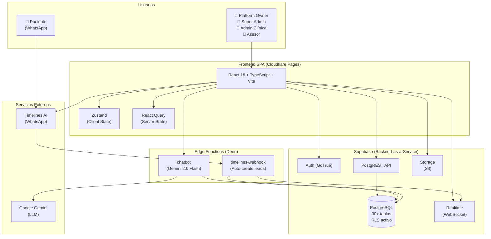

# 1Clinic CRM — SaaS Multi-Tenant para Operaciones Médicas y Comerciales

[](https://react.dev)
[](https://supabase.com)
[](https://vitejs.dev)
[](https://pages.cloudflare.com)

**1Clinic CRM** es una plataforma SaaS multi-tenant horizontal que gestiona el ciclo de vida completo paciente/cliente — desde la captación de leads hasta la fidelización clínica — con aislamiento de datos por Row Level Security (RLS) nativo en PostgreSQL.

**Dominio de producción**: `*.1clc.app` (subdominios por tenant)

---

## 📖 Tabla de Contenidos

- [Quick Start](#-quick-start)
- [Variables de Entorno](#-variables-de-entorno)
- [Stack Tecnológico](#-stack-tecnológico)
- [Arquitectura](#-arquitectura)
- [Estructura del Proyecto](#-estructura-del-proyecto)
- [Módulos Funcionales](#-módulos-funcionales)
- [Sistema de Roles (RBAC)](#-sistema-de-roles-rbac)
- [Feature Flags](#-feature-flags)
- [Integraciones Externas](#-integraciones-externas)
- [Comandos Útiles](#-comandos-útiles)
- [Documentación Técnica](#-documentación-técnica)
- [Convenciones de Código](#-convenciones-de-código)

---

## 🚀 Quick Start

### Prerrequisitos

| Herramienta | Versión Mínima | Propósito |
|-------------|---------------|-----------|
| **Node.js** | 18.x LTS | Runtime de JavaScript |
| **npm** | 9.x | Gestor de paquetes |
| **Git** | 2.x | Control de versiones |
| **Supabase CLI** | 1.x | Edge Functions (solo si modificas backend) |
| **Deno** | 1.40+ | Runtime de Edge Functions (solo backend) |

### Instalación

```bash
# 1. Clonar el repositorio
git clone <repo-url> crm-clinicas
cd crm-clinicas

# 2. Instalar dependencias
npm install

# 3. Configurar variables de entorno
cp .env.example .env.local
# Editar .env.local con las credenciales de Supabase (ver sección siguiente)

# 4. Iniciar el servidor de desarrollo
npm run dev
```

**Resultado esperado**:
```
  VITE v5.1.4  ready in 400ms

  ➜  Local:   http://localhost:5173/
  ➜  Network: use --host to expose
```

### Primer acceso

1. Navegar a `http://localhost:5173/login`
2. Ingresar las credenciales de un usuario existente en Supabase Auth.
3. El sistema resuelve el `clinica_slug` del usuario y carga el dashboard correspondiente a su rol.

---

## 🔐 Variables de Entorno

Crear un archivo `.env.local` en la raíz del proyecto:

```env
# ═══════════════════════════════════════════════════════════════
# SUPABASE — Obligatorias para que la aplicación funcione
# ═══════════════════════════════════════════════════════════════
VITE_SUPABASE_URL=https://tu-proyecto.supabase.co
VITE_SUPABASE_ANON_KEY=eyJhbGciOiJIUzI1NiIsInR5cCI6IkpXVCJ9...
```

| Variable | Requerida | Dónde obtenerla | Descripción |
|----------|-----------|-----------------|-------------|
| `VITE_SUPABASE_URL` | ✅ Sí | Supabase Dashboard → Settings → API | URL del proyecto Supabase |
| `VITE_SUPABASE_ANON_KEY` | ✅ Sí | Supabase Dashboard → Settings → API | Clave pública `anon` (RLS la protege) |

### Secrets de Edge Functions (Supabase Dashboard)

Estas NO van en `.env.local`. Se configuran directamente en Supabase:

| Secret | Edge Function | Propósito |
|--------|--------------|-----------|
| `GEMINI_API_KEY` | `chatbot` | API key de Google Gemini 2.0 Flash para el chatbot IA |
| `TIMELINES_WEBHOOK_SECRET` | `timelines-webhook` | Shared secret para validar webhooks de Timelines AI |

> **🔒 Seguridad**: La API key de Timelines AI se almacena encriptada en la base de datos y se expone al frontend solo vía la RPC `get_timelines_api_key()`.

---

## 🧱 Stack Tecnológico

### Frontend

| Capa | Tecnología | Versión | Propósito |
|------|-----------|---------|-----------|
| **UI Framework** | React | 18.2 | Componentes declarativos con hooks |
| **Lenguaje** | TypeScript | 5.2 | Tipado strict (`strict: true`) |
| **Build Tool** | Vite | 5.1 | HMR sub-segundo, ESBuild |
| **Styling** | Tailwind CSS | 3.4 | Utility-first CSS |
| **Routing** | React Router | 7.13 | Rutas dinámicas por rol + `ModuleGuard` |
| **Server State** | TanStack React Query | 5.90 | Caché, invalidación, optimistic updates |
| **Client State** | Zustand | 4.5 | Estado síncrono: usuario, rol, tenant |
| **Virtualización** | @tanstack/react-virtual | 3.13 | Scroll infinito para 500K+ registros |
| **Iconos** | Lucide React | 0.344 | SVGs inline (tree-shakeable) |
| **Utilitarios** | clsx + tailwind-merge | 2.1 / 2.2 | Composición condicional de clases CSS |

### Backend (Supabase BaaS)

| Servicio | Tecnología | Propósito |
|----------|-----------|-----------|
| **Base de Datos** | PostgreSQL (Managed) | 30+ tablas con RLS multi-tenant |
| **Autenticación** | Supabase Auth (GoTrue) | JWT, password reset, invitaciones |
| **API REST** | PostgREST (auto-generated) | CRUD automático que respeta RLS |
| **Realtime** | Supabase Realtime | WebSocket para notificaciones de chat |
| **Storage** | Supabase Storage (S3) | Avatares, logos (2MB cap) |
| **Edge Functions** | Deno (Serverless) | `chatbot` (Gemini IA), `timelines-webhook` |

### Hosting & CDN

| Servicio | Propósito |
|----------|-----------|
| **Cloudflare Pages** | Deploy del SPA + CDN global |
| **Wildcard DNS** | `*.1clc.app` → subdominios por tenant |

---

## 🏗 Arquitectura



### Principios Arquitectónicos

| # | Decisión | Por qué |
|---|----------|---------|
| ADR-01 | SPA pura (sin SSR) | Prioridad en UX dashboard vs. SEO |
| ADR-02 | Supabase como BaaS completo | Auth + DB + Storage + Realtime en una plataforma |
| ADR-03 | RLS nativo para multi-tenancy | Aislamiento inviolable a nivel de motor DB |
| ADR-04 | Subdominios para tenant routing | `{slug}.1clc.app` — branding visual por tenant |
| ADR-05 | React Query = fuente de verdad async | Invalidación automática, optimistic UI |
| ADR-06 | Zustand solo estado síncrono | Rol, `tenant_id`, `active_modules` |
| ADR-07 | Feature Flags por JSONB | `active_modules[]` habilita/deshabilita módulos por tenant |
| ADR-08 | Edge Functions para lógica sensible | API keys nunca expuestas al frontend |
| ADR-09 | UniversalPipelineBoard | Un componente configurable para leads, citas y deals |
| ADR-10 | Virtualización DOM | `@tanstack/react-virtual` para 500K+ registros |

> 📖 Documentación completa de arquitectura: [`docs/architecture/context_and_containers.md`](docs/architecture/context_and_containers.md)

---

## 📁 Estructura del Proyecto

```
crm-clinicas/
├── .env.example                    # Template de variables de entorno
├── .env.local                      # Variables locales (git-ignored)
├── index.html                      # Entry point HTML
├── package.json                    # Dependencias y scripts
├── tsconfig.json                   # TypeScript strict mode
├── vite.config.ts                  # Configuración de Vite
├── tailwind.config.js              # Configuración de Tailwind CSS
├── postcss.config.js               # PostCSS (Tailwind pipeline)
│
├── docs/                           # 📖 Documentación técnica
│   ├── architecture/
│   │   └── context_and_containers.md    # C4 + ADRs
│   ├── database/
│   │   └── data_dictionary.md           # 30+ tablas, RPC, triggers
│   ├── integrations/
│   │   └── api_endpoints.md             # API surface map completo
│   ├── modules/
│   │   ├── 01_leads_pipeline.md
│   │   ├── 02_patients_management.md
│   │   ├── 03_appointments.md
│   │   ├── 04_calendar_tasks.md
│   │   ├── 05_chat_whatsapp.md
│   │   ├── 06_chatbot_ai.md
│   │   ├── 07_dashboards_reports.md
│   │   └── 08_organizations_settings.md
│   └── onboarding_guide.md              # Guía de onboarding para devs
│
├── src/
│   ├── App.tsx                     # Root: auth bootstrap + route table
│   ├── main.tsx                    # Entry point React
│   │
│   ├── core/                       # 🔧 Motor genérico SaaS (cualquier industria)
│   │   ├── auth/                   #   Login multi-tenant, ModuleGuard, Onboarding
│   │   ├── dashboards/             #   RootDashboard → triple routing por rol
│   │   ├── leads/                  #   Pipeline Kanban + LeadDetail + LeadsTable
│   │   ├── organizations/          #   Clínicas, Sucursales, Equipo, PipelineConfig
│   │   ├── settings/               #   Hub de configuración (Dual Sidebar)
│   │   ├── catalogs/               #   Servicios, Equipo, Doctores
│   │   ├── analytics/              #   ReportsDashboard
│   │   ├── calendar/               #   CalendarTasks (Kanban de tareas)
│   │   ├── chat/                   #   ChatModule (WhatsApp vía Timelines AI)
│   │   └── chatbot/                #   ChatbotModule (IA con Gemini)
│   │
│   ├── modules/                    # 🏥 Plugins acoplables por industria
│   │   └── clinic/                 #   Requiere active_module="clinic_core"
│   │       ├── appointments/       #     Pipeline de citas médicas
│   │       ├── patients/           #     Directorio, detalle, deals
│   │       └── doctors/            #     (gestionados en catalogs)
│   │
│   ├── components/                 # 🧩 Componentes compartidos
│   │   ├── pipeline/               #   UniversalPipelineBoard
│   │   └── tasks/                  #   EntityTasks
│   │
│   ├── services/                   # 🔌 Capa de servicios (API clients)
│   │   ├── supabase.ts             #   Cliente Supabase singleton
│   │   ├── timelinesAIService.ts   #   API completa de Timelines AI (586 líneas)
│   │   ├── chatbotService.ts       #   CRUD chatbot + Edge Function invoke
│   │   └── taskSequenceExecution.ts #  Motor de secuencias automáticas
│   │
│   ├── store/                      # 📦 Zustand (estado síncrono)
│   │   └── useStore.ts             #   currentUser: rol, tenant_id, modules
│   │
│   ├── hooks/                      # 🪝 Custom hooks
│   │   └── useClinicTags.ts        #   Tags globales del CRM
│   │
│   └── utils/                      # 🛠 Utilidades
│       ├── getTenantSlug.ts        #   Extrae slug del subdomain
│       └── applyBrandColor.ts      #   Inyección de CSS dinámico
│
└── supabase/
    └── functions/                  # ⚡ Edge Functions (Deno)
        ├── chatbot/index.ts        #   Proxy a Gemini con RAG
        └── timelines-webhook/index.ts # Receptor de webhooks WhatsApp
```

---

## 📦 Módulos Funcionales

| # | Módulo | Ruta | Feature Flag | Descripción |
|---|--------|------|-------------|-------------|
| 01 | **Leads Pipeline** | `/leads` | — | Embudo de ventas Kanban con drag & drop, SLA, gatekeeping |
| 02 | **Pacientes** | `/pacientes` | `clinic_core` | Directorio virtualizado, deals, historial, CSV export |
| 03 | **Citas Médicas** | `/citas` | `clinic_core` | Pipeline de sala de espera con SLA visual |
| 04 | **Tareas** | `/tareas` | — | Kanban de tareas con secuencias automáticas |
| 05 | **Chat WhatsApp** | `/chat` | `chat_whatsapp` | Bandeja de entrada WhatsApp con Timelines AI |
| 06 | **Chatbot IA** | `/chatbot` | — (Solo Super_Admin) | Asistente Clara con Gemini 2.0 Flash + RAG |
| 07 | **Dashboards** | `/dashboard` | — | KPIs diferenciados por rol (3 niveles) |
| 08 | **Reportes** | `/reportes` | `analytics` | Analytics avanzados con filtros temporales |
| 09 | **Organizaciones** | `/gestion` | — (Solo Super_Admin) | Clínicas, sucursales, equipo, pipelines |
| 10 | **Configuración** | `/configuracion` | — | Settings hub con sidebar anidado |

---

## 🛡 Sistema de Roles (RBAC)

```
Platform_Owner          ← Dueño del SaaS. Ve todas las clínicas.
  └── Super_Admin       ← Dueño del tenant. Configura todo su entorno.
       └── Admin_Clinica     ← Gerente regional. Dashboard analítico.
            └── Asesor_Sucursal  ← Empleado operativo. Filtrado por sucursal.
```

| Rol | Dashboard | Leads | Pacientes | Settings | Clínicas |
|-----|-----------|-------|-----------|----------|----------|
| `Platform_Owner` | Global SaaS | — | — | Plataforma | ✅ CRUD |
| `Super_Admin` | Admin Clínica | Tabla admin | Tabla admin | Full | — |
| `Admin_Clinica` | Gerencial | Kanban | Kanban | Limitado | — |
| `Asesor_Sucursal` | Táctico | Kanban (su sucursal) | Directorio (su sucursal) | Perfil + Seguridad | — |

### Capas de Seguridad

1. **Frontend**: `ModuleGuard` + route guards por `currentUser.role`
2. **API**: JWT token con `clinica_id` en payload
3. **Database**: RLS con `get_user_clinica_id()` — aislamiento inviolable
4. **Edge Functions**: Service Role Key + validación UUID

---

## 🚩 Feature Flags

Los módulos se habilitan/deshabilitan por tenant mediante el array JSONB `clinicas.active_modules`:

```typescript
// Ejemplo de active_modules en la tabla clinicas
["clinic_core", "chat_whatsapp", "analytics", "automations"]
```

| Flag | Módulo que desbloquea |
|------|-----------------------|
| `clinic_core` | Pacientes, Citas, Doctores |
| `chat_whatsapp` | Chat WhatsApp (Timelines AI) |
| `analytics` | Reportes avanzados |
| `automations` | Secuencias de tareas automáticas |

El componente `ModuleGuard` ([`src/core/auth/ModuleGuard.tsx:10-22`](src/core/auth/ModuleGuard.tsx)) intercepta el renderizado y redirige al dashboard si el tenant no tiene el módulo contratado.

---

## 🔌 Integraciones Externas

| Sistema | Protocolo | Dirección | Propósito |
|---------|-----------|-----------|-----------|
| **Supabase Auth** | HTTPS (GoTrue) | Frontend → Auth | Autenticación JWT, signup, password reset |
| **Supabase PostgREST** | HTTPS (REST) | Frontend → API | CRUD con RLS automático |
| **Supabase Realtime** | WebSocket | Frontend ← Realtime | Notificaciones de chat en tiempo real |
| **Google Gemini 2.0 Flash** | HTTPS | Edge Function → API | Chatbot IA con RAG |
| **Timelines AI** | HTTPS (REST) | Bidireccional | Chat WhatsApp (envío + recepción vía webhook) |
| **Calendly** | JS Embed | Widget inline | Agendamiento de citas en página pública |
| **Hotmart** | Redirect | Frontend → Checkout | Pasarela de pago para productos/servicios |
| **Cloudflare Pages** | CDN | CDN → Browser | Hosting y distribución del SPA |

---

## 🧰 Comandos Útiles

```bash
# Desarrollo
npm run dev              # Inicia Vite dev server (http://localhost:5173)
npm run build            # Compila TypeScript + Build de producción
npm run preview          # Preview del build de producción
npm run lint             # ESLint con 0 warnings enforced

# Supabase Edge Functions (requiere Supabase CLI)
supabase functions serve chatbot --env-file .env.local           # Probar chatbot localmente
supabase functions serve timelines-webhook --env-file .env.local # Probar webhook localmente
supabase functions deploy chatbot                                # Deploy a producción
supabase functions deploy timelines-webhook                      # Deploy a producción

# Producción
npm run build && npx wrangler pages deploy dist                  # Deploy a Cloudflare Pages
```

---

## 📖 Documentación Técnica

| Documento | Descripción |
|-----------|-------------|
| [`docs/architecture/context_and_containers.md`](docs/architecture/context_and_containers.md) | Diagramas C4, integraciones, 10 ADRs |
| [`docs/database/data_dictionary.md`](docs/database/data_dictionary.md) | 30+ tablas, 8 RPCs, triggers, indexes |
| [`docs/integrations/api_endpoints.md`](docs/integrations/api_endpoints.md) | API surface: Supabase + Timelines AI + Edge Functions |
| [`docs/modules/01_leads_pipeline.md`](docs/modules/01_leads_pipeline.md) | Módulo de leads: Kanban, detalle, conversión |
| [`docs/modules/02_patients_management.md`](docs/modules/02_patients_management.md) | Módulo de pacientes: directorio, deals, export |
| [`docs/modules/03_appointments.md`](docs/modules/03_appointments.md) | Módulo de citas: pipeline, SLA, sala de espera |
| [`docs/modules/04_calendar_tasks.md`](docs/modules/04_calendar_tasks.md) | Módulo de tareas: Kanban + secuencias automáticas |
| [`docs/modules/05_chat_whatsapp.md`](docs/modules/05_chat_whatsapp.md) | Módulo de chat: Timelines AI, realtime, optimistic |
| [`docs/modules/06_chatbot_ai.md`](docs/modules/06_chatbot_ai.md) | Módulo de chatbot: Gemini, RAG, knowledge base |
| [`docs/modules/07_dashboards_reports.md`](docs/modules/07_dashboards_reports.md) | Módulo de dashboards: triple routing por rol |
| [`docs/modules/08_organizations_settings.md`](docs/modules/08_organizations_settings.md) | Módulo de organizaciones: config, pipelines, branding |
| [`docs/onboarding_guide.md`](docs/onboarding_guide.md) | Guía de onboarding para nuevos desarrolladores |

---

## ✍️ Convenciones de Código

| Regla | Detalle |
|-------|--------|
| **TypeScript Strict** | `strict: true` en `tsconfig.json`. Sin `any`. |
| **Naming** | PascalCase para componentes, camelCase para hooks y funciones |
| **Server State** | Todo fetch async → React Query (`useQuery` / `useMutation`) |
| **Client State** | Solo Zustand para: `currentUser`, rol, `active_modules` |
| **Imports** | Absolutos desde `src/`. No relative traversals profundos (`../../..`) |
| **Comentarios** | Español en codelabels de UI. Inglés en comentarios técnicos internos |
| **ESLint** | 0 warnings enforced en CI. Sin `console.log` en producción |
| **React Query Keys** | Patrón: `['entity', clinica_id, filters]` para cache granular |
| **RLS** | Toda tabla nueva DEBE tener política RLS con `get_user_clinica_id()` |

---

## 📄 Licencia

Código propietario. © 1Conecta. Todos los derechos reservados.
