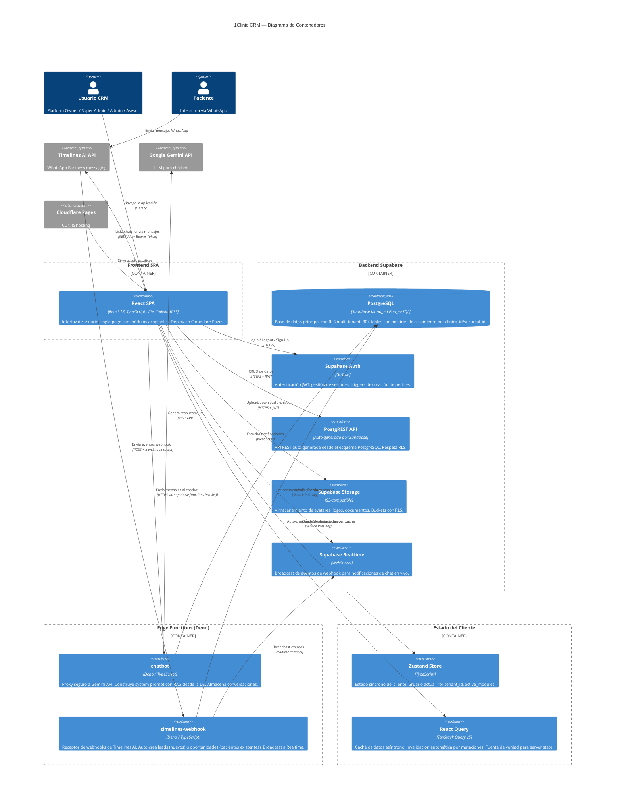
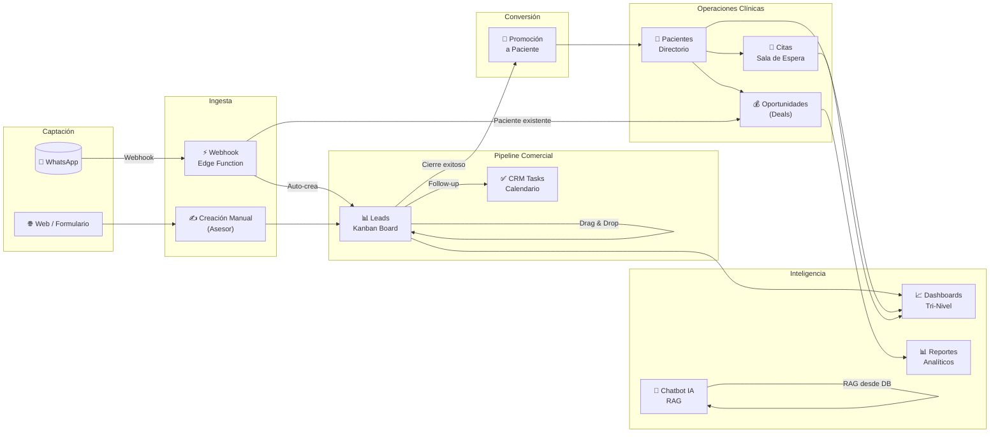
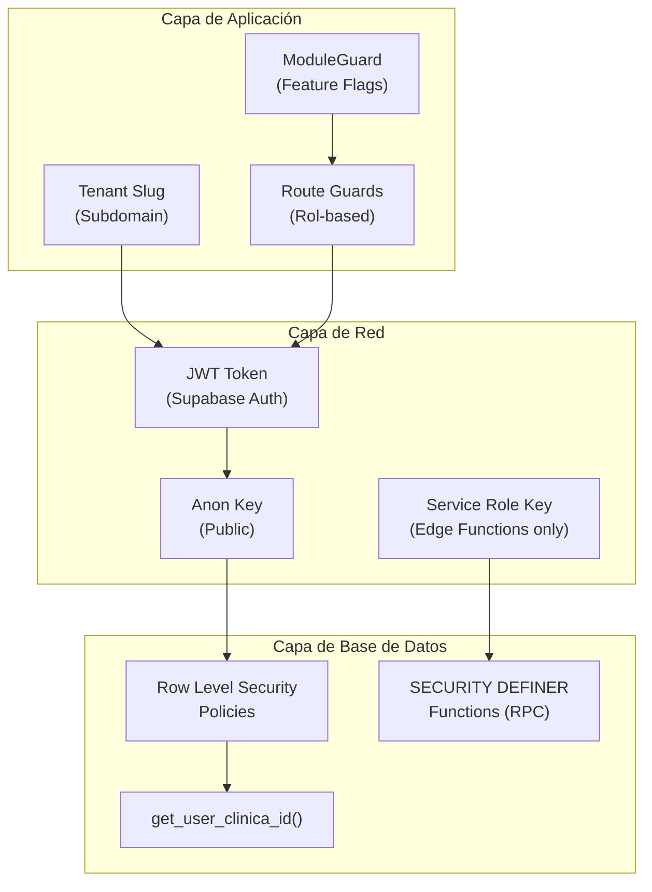

# 1Clinic CRM — Arquitectura C4: Contexto y Contenedores

> **Fecha de auditoría**: 2026-04-08  
> **Sistema**: 1Clinic CRM (SaaS Multi-Tenant Horizontal)  
> **Dominio de producción**: `*.1clc.app`  
> **Repositorio**: `crm-clinicas`

---

## 1. Visión General del Sistema

### Descripción Corta
**1Clinic CRM** es una plataforma SaaS multi-tenant horizontal que gestiona el ciclo de vida completo paciente/cliente — desde la captación de leads hasta la fidelización clínica — con aislamiento de datos por Row Level Security (RLS) nativo en PostgreSQL.

### Descripción Extendida
El sistema está diseñado como una **Single Page Application (SPA)** de grado empresarial que sirve indiscriminadamente a clínicas médicas, despachos, agencias y cualquier tipo de negocio bajo una misma base de código. La plataforma combina:

- **CRM Comercial**: Gestión de leads con tableros Kanban configurables, embudos de ventas, y seguimiento de oportunidades (deals).
- **Módulo Clínico (Plugin)**: Citas médicas con SLA en sala de espera, expediente de pacientes, historial clínico y cross-selling.
- **Chatbot IA**: Asistente virtual por tenant con RAG (Retrieval-Augmented Generation) alimentado por base de conocimiento y función calling vía Gemini API.
- **Chat WhatsApp**: Integración bidireccional con Timelines AI para mensajería, automatización de leads y plantillas conversacionales.
- **Automatizaciones**: Secuencias de tareas (Task Sequences) con triggers programáticos por evento de pipeline.
- **Multi-tenancy con RBAC**: Cuatro niveles de roles (`Platform_Owner`, `Super_Admin`, `Admin_Clinica`, `Asesor_Sucursal`) con aislamiento por `clinica_id` y `sucursal_id`.

---

## 2. Diagrama de Contexto del Sistema (C4 Nivel 1)

```mermaid
C4Context
    title 1Clinic CRM — Diagrama de Contexto del Sistema

    Person(platformOwner, "Platform Owner", "Dueño del SaaS. Gestiona clínicas, suscripciones y configuración global de la plataforma.")
    Person(superAdmin, "Super Admin / Dueño de Clínica", "Administrador supremo del tenant. Configura embudos, equipo, servicios, chatbot y sucursales.")
    Person(adminClinica, "Admin Clínica", "Gerente regional. Supervisa operaciones de múltiples sucursales.")
    Person(asesor, "Asesor de Sucursal", "Empleado operativo. Atiende leads, pacientes, citas y tareas del día a día.")
    Person(patient, "Paciente / Lead", "Persona externa que interactúa con la clínica vía WhatsApp o formulario.")

    System(clinic_crm, "1Clinic CRM", "SPA React + Supabase. Plataforma SaaS multi-tenant para gestión comercial y clínica.")

    System_Ext(supabase_auth, "Supabase Auth", "Autenticación JWT, gestión de sesiones y control de acceso.")
    System_Ext(supabase_db, "Supabase PostgreSQL", "Base de datos relacional con RLS nativo para aislamiento multi-tenant.")
    System_Ext(supabase_storage, "Supabase Storage", "Almacenamiento de archivos (avatares, logos, documentos).")
    System_Ext(supabase_functions, "Supabase Edge Functions", "Funciones serverless en Deno para lógica backend segura.")
    System_Ext(supabase_realtime, "Supabase Realtime", "Canal de eventos WebSocket para notificaciones en tiempo real.")
    System_Ext(gemini, "Google Gemini API", "LLM para generación de respuestas del chatbot IA con RAG.")
    System_Ext(timelines, "Timelines AI", "API de WhatsApp Business para envío/recepción de mensajes, archivos y notas.")
    System_Ext(calendly, "Calendly", "Widget embebido para agendamiento de citas externas (página pública).")
    System_Ext(hotmart, "Hotmart", "Plataforma de checkout y pagos para la venta de productos/servicios.")
    System_Ext(credibanco, "Credibanco / PayPal", "Pasarelas de pago para cobros nacionales e internacionales.")
    System_Ext(cloudflare, "Cloudflare Pages", "CDN y hosting para el deploy del frontend SPA.")

    Rel(platformOwner, clinic_crm, "Gestiona clínicas & configuración global")
    Rel(superAdmin, clinic_crm, "Configura tenant, equipo, embudos, chatbot")
    Rel(adminClinica, clinic_crm, "Supervisa operaciones multi-sucursal")
    Rel(asesor, clinic_crm, "Opera leads, citas, pacientes, tareas diarias")
    Rel(patient, timelines, "Envía mensajes WhatsApp")

    Rel(clinic_crm, supabase_auth, "Autentica usuarios", "JWT / HTTPS")
    Rel(clinic_crm, supabase_db, "Lee/escribe datos", "PostgREST / HTTPS")
    Rel(clinic_crm, supabase_storage, "Sube/descarga archivos", "HTTPS")
    Rel(clinic_crm, supabase_realtime, "Escucha eventos en vivo", "WebSocket")
    Rel(clinic_crm, supabase_functions, "Invoca Edge Functions", "HTTPS")
    Rel(clinic_crm, timelines, "Envía/recibe mensajes WhatsApp", "REST API")
    Rel(clinic_crm, calendly, "Renderiza widget de agendamiento", "JS Embed")

    Rel(supabase_functions, gemini, "Genera respuestas IA", "REST API")
    Rel(timelines, supabase_functions, "Envía webhooks de mensajes entrantes", "POST")
    Rel(supabase_functions, supabase_db, "Lee/escribe contexto para RAG", "Service Role Key")
```



---

## 3. Personas del Sistema

| Persona | Tipo | Rol RBAC | Descripción | Funciones clave |
|---------|------|----------|-------------|-----------------|
| **Platform Owner** | Humano | `Platform_Owner` | Dueño del SaaS (1Conecta). Ve todas las clínicas. | MRR global, gestión de tenants, branding de plataforma |
| **Super Admin** | Humano | `Super_Admin` | Dueño del tenant (Clínica). Máxima autoridad dentro de su organización. | Configuración del tenant, embudos, equipo, catalogs, chatbot IA, automatizaciones |
| **Admin Clínica** | Humano | `Admin_Clinica` | Gerente regional / supervisor multi-sucursal. | Dashboard gerencial, reportes analíticos, supervisión, KPIs |
| **Asesor Sucursal** | Humano | `Asesor_Sucursal` | Empleado de piso. Visibilidad restringida a su sucursal. | Leads Kanban, citas, pacientes, chat WhatsApp, tareas tácticas |
| **Paciente / Lead** | Humano externo | N/A | Cliente final que interactúa por WhatsApp o formularios. | Envía mensajes, agenda citas, recibe respuestas del chatbot |
| **Timelines AI** | Sistema externo | N/A | API de mensajería WhatsApp. | Webhook → auto-creación de leads, envío/recepción de mensajes |
| **Google Gemini** | Sistema externo | N/A | LLM de Google para el chatbot IA. | Respuestas conversacionales con RAG contextual |

---

## 4. Diagrama de Contenedores (C4 Nivel 2)



---

## 5. Inventario de Contenedores

### 5.1 Frontend SPA (`spa`)

| Atributo | Valor |
|----------|-------|
| **Tecnología** | React 18 + TypeScript + Vite |
| **Styling** | Tailwind CSS 3.4 + Lucide React (iconos SVG) |
| **Routing** | React Router v7 (subdomain-based tenancy: `{slug}.1clc.app`) |
| **State: Server** | TanStack React Query v5 (caché, invalidación, fetching) |
| **State: Client** | Zustand 4.5 (rol, tenant_id, active_modules) |
| **Virtualización** | `@tanstack/react-virtual` (scroll infinito para 500K+ registros) |
| **Deploy** | Cloudflare Pages |
| **Módulos activos** | Core (leads, dashboards, calendario, chat, settings) + Plugin `clinic_core` (pacientes, citas, doctores) |

### 5.2 PostgreSQL (`db`)

| Atributo | Valor |
|----------|-------|
| **Proveedor** | Supabase Managed PostgreSQL (AWS us-east-1) |
| **Seguridad** | Row Level Security (RLS) en todas las tablas. Aislamiento por `clinica_id` vía `get_user_clinica_id()` |
| **Roles DB** | ENUM `user_role`: `Platform_Owner`, `Super_Admin`, `Admin_Clinica`, `Asesor_Sucursal` |
| **Functions RPC** | `get_tenant_slug_by_email()`, `is_slug_available()`, `create_new_tenant()`, `set_platform_owner()`, `verify_team_invitation()`, `accept_team_invitation()`, `get_my_profile()` |
| **Triggers** | `fn_track_stage_change()` → auditoría automática de movimientos Kanban en `pipeline_history_log` |
| **Tablas** | 30+ tablas (ver Data Dictionary) |

### 5.3 Edge Function: `chatbot`

| Atributo | Valor |
|----------|-------|
| **Runtime** | Deno (Supabase Edge Functions) |
| **API externa** | Google Gemini 2.0 Flash |
| **Patrón** | RAG: construye system prompt dinámico desde `chatbot_knowledge_base`, `chatbot_branch_info`, `services`, `service_knowledge`, `doctors` |
| **Seguridad** | Valida UUID format, verifica `chatbot_config.is_active`, valida cross-tenant en conversations |
| **Secrets** | `GEMINI_API_KEY` (Supabase Secrets) |

### 5.4 Edge Function: `timelines-webhook`

| Atributo | Valor |
|----------|-------|
| **Runtime** | Deno (Supabase Edge Functions) |
| **Trigger** | POST desde Timelines AI (`message:received:new`, etc.) |
| **Lógica** | (1) Guarda evento en `chat_webhook_events`. (2) Si mensaje entrante de número desconocido → crea Lead. (3) Si número pertenece a paciente existente → crea Deal. |
| **Seguridad** | Validación de `x-webhook-secret`. Service Role Key para bypass de RLS. |

### 5.5 Timelines AI (Externo)

| Atributo | Valor |
|----------|-------|
| **Tipo** | API REST externa de WhatsApp Business |
| **Base URL** | `https://app.timelines.ai/integrations/api` |
| **Autenticación** | Bearer Token (almacenado en `clinicas.timelines_ai_api_key_enc`) |
| **Operaciones** | Chats (listar, filtrar, cerrar, asignar), Mensajes (enviar texto, archivos, notas de voz), Templates, Labels, Webhooks |
| **Interacción** | Frontend → API directa (lectura/envío). Timelines → Webhook Edge Function (recepción). |

---

## 6. Integraciones Externas

| Sistema | Protocolo | Dirección | Propósito | Configuración |
|---------|-----------|-----------|-----------|---------------|
| **Supabase Auth** | HTTPS (GoTrue) | Frontend → Auth | Autenticación JWT, signup, password reset, session management | Variables de entorno: `VITE_SUPABASE_URL`, `VITE_SUPABASE_ANON_KEY` |
| **Supabase PostgREST** | HTTPS (REST) | Frontend → API | CRUD de todas las tablas con RLS | Incluido en Supabase Client |
| **Supabase Storage** | HTTPS (S3) | Frontend → Storage | Upload de avatares (2MB cap), logos corporativos | Buckets con RLS por `auth.uid()` |
| **Supabase Realtime** | WebSocket | Frontend ← Realtime | Notificaciones de chat en tiempo real | Channel `chat_webhook_events` |
| **Supabase Edge Functions** | HTTPS | Frontend → Functions | Chatbot IA, Webhook receiver | `supabase.functions.invoke('chatbot')` |
| **Google Gemini 2.0 Flash** | HTTPS (REST) | Edge Fn → Gemini | Generación de respuestas IA con RAG | Secret: `GEMINI_API_KEY` |
| **Timelines AI** | HTTPS (REST) | Frontend → Timelines | Chat WhatsApp bidireccional | Bearer Token por tenant |
| **Timelines AI Webhook** | HTTPS (POST) | Timelines → Edge Fn | Recepción de mensajes entrantes | Header: `x-webhook-secret` |
| **Calendly** | JS Embed | Frontend (widget) | Agendamiento de citas en página pública | Widget inline embebido |
| **Hotmart** | Redirect | Frontend → Hotmart | Checkout de productos/servicios | URLs de redirect post-pago |
| **Credibanco / PayPal** | External Link | Frontend → Pasarela | Cobro de consultas y servicios | Links de pago por tenant |
| **Cloudflare Pages** | CDN | CDN → Browser | Hosting y distribución del SPA | Deploy automático |

---

## 7. Flujo de Datos Principal



---

## 8. Decisiones Arquitectónicas Clave

| # | Decisión | Justificación |
|---|----------|---------------|
| **ADR-01** | SPA pura (sin SSR) | Prioridad en UX de aplicación dashboard vs SEO. Deploy simple en CDN. |
| **ADR-02** | Supabase como BaaS completo | Reduce complejidad operacional: Auth + DB + Storage + Realtime + Edge Functions en una sola plataforma. |
| **ADR-03** | RLS nativo en PostgreSQL para multi-tenancy | Aislamiento inviolable a nivel de motor de base de datos, no de aplicación. Imposible bypass desde el frontend. |
| **ADR-04** | Subdominios para tenant routing | `{slug}.1clc.app` permite branding por tenant y aislamiento visual sin path-based routing. |
| **ADR-05** | React Query como fuente de verdad para server state | Elimina re-fetches, maneja invalidación automática, optimistic UI en Kanban. |
| **ADR-06** | Zustand solo para estado síncrono del cliente | Rol, tenant_id, active_modules. Todo lo async es React Query. |
| **ADR-07** | Feature Flags por JSONB (`active_modules`) | Permite habilitar/deshabilitar módulos por tenant sin deploys. `ModuleGuard` bloquea rutas en frontend. |
| **ADR-08** | Edge Functions para lógica sensible | API keys (Gemini, Timelines) nunca expuestas en el frontend. Service Role Key para bypass de RLS en webhook. |
| **ADR-09** | Tablero Kanban universal (`UniversalPipelineBoard`) | Un solo componente configurable para leads, citas y deals. Reduce duplicación de código. |
| **ADR-10** | Virtualización DOM para alto volumen | `@tanstack/react-virtual` permite 500K+ registros sin impacto en rendimiento. |

---

## 9. Estructura de Módulos Frontend

```
src/
├── core/                          # Motor genérico SaaS (cualquier industria)
│   ├── auth/                      # Login multi-tenant, ModuleGuard, Onboarding, Invitaciones
│   ├── dashboards/                # RootDashboard → Tri-Level (SuperAdmin, AdminClinica, Asesor)
│   ├── leads/                     # Pipeline Kanban, LeadDetail, LeadsTable
│   ├── organizations/             # Clínicas, Sucursales, Equipo, PipelineConfig, Automatizaciones
│   ├── settings/                  # Hub de configuración (Dual Sidebar)
│   ├── catalogs/                  # Servicios, Equipo, CatalogsManagement
│   ├── analytics/                 # ReportsDashboard
│   ├── calendar/                  # CalendarTasks (gestión de tareas)
│   ├── chat/                      # ChatModule (WhatsApp vía Timelines AI)
│   └── chatbot/                   # ChatbotModule (IA con Gemini)
├── modules/                       # Plugins acoplables por industria
│   └── clinic/                    # Plugin médico (requiere active_module="clinic_core")
│       ├── appointments/          # Citas con SLA Kanban
│       ├── patients/              # Directorio, PatientDetail, DealsPipeline
│       └── doctors/               # (vacío — doctores en catalogs/services)
├── components/                    # Componentes compartidos
│   ├── pipeline/                  # UniversalPipelineBoard
│   └── tasks/                     # EntityTasks
├── services/                      # Capa de servicios (API clients)
│   ├── supabase.ts                # Cliente Supabase
│   ├── timelinesAIService.ts      # API Timelines AI completa
│   ├── chatbotService.ts          # CRUD chatbot + invocación Edge Fn
│   └── taskSequenceExecution.ts   # Motor de secuencias automáticas
├── store/                         # Zustand (estado síncrono)
├── hooks/                         # Custom hooks (useClinicTags, etc.)
└── utils/                         # Utilidades (getTenantSlug, applyBrandColor)
```

---

## 10. Seguridad — Modelo Multi-Tenant



| Capa | Mecanismo | Alcance |
|------|-----------|---------|
| **Frontend** | `ModuleGuard` + Route Guards | Oculta rutas/módulos no contratados o no autorizados por rol |
| **API** | JWT token con `clinica_id` en payload | Cada request lleva identidad del tenant |
| **Base de Datos** | RLS con `get_user_clinica_id()` | Aislamiento matemático por tenant. Imposible leer datos ajenos incluso hackeando el frontend |
| **Edge Functions** | Service Role Key + validación UUID | Bypass de RLS controlado solo para operaciones backend seguras |
| **Storage** | Bucket RLS por `auth.uid()` | Archivos (avatares, logos) protegidos por usuario |
