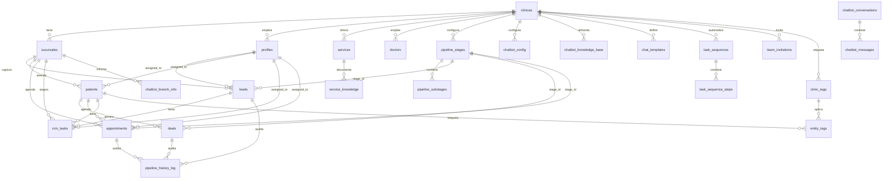

# 1Clinic CRM — Diccionario de Datos

> **Fecha de auditoría**: 2026-04-08  
> **Motor**: PostgreSQL (Supabase Managed, AWS us-east-1)  
> **Esquema**: `public`  
> **Seguridad**: Row Level Security (RLS) habilitado en todas las tablas

---

## Índice de Contenido

1. [Modelo Entidad-Relación](#1-modelo-entidad-relación)
2. [Dominio: Tenancy (Multi-Tenant Core)](#2-dominio-tenancy-multi-tenant-core)
3. [Dominio: Identidad y Acceso](#3-dominio-identidad-y-acceso)
4. [Dominio: Pipeline Comercial (Leads)](#4-dominio-pipeline-comercial-leads)
5. [Dominio: Clínico (Pacientes, Citas, Deals)](#5-dominio-clínico-pacientes-citas-deals)
6. [Dominio: Pipeline Engine (Fases y Auditoría)](#6-dominio-pipeline-engine-fases-y-auditoría)
7. [Dominio: Tareas y Automatizaciones](#7-dominio-tareas-y-automatizaciones)
8. [Dominio: Chatbot IA](#8-dominio-chatbot-ia)
9. [Dominio: Chat WhatsApp](#9-dominio-chat-whatsapp)
10. [Dominio: Catálogos](#10-dominio-catálogos)
11. [Dominio: Tags y Etiquetas](#11-dominio-tags-y-etiquetas)
12. [Dominio: Configuración de Plataforma](#12-dominio-configuración-de-plataforma)
13. [Dominio: Almacenamiento](#13-dominio-almacenamiento)
14. [Funciones RPC (Stored Procedures)](#14-funciones-rpc-stored-procedures)
15. [Triggers](#15-triggers)
16. [Tipos ENUM](#16-tipos-enum)
17. [Índices de Rendimiento](#17-índices-de-rendimiento)

---

## 1. Modelo Entidad-Relación



---

## 2. Dominio: Tenancy (Multi-Tenant Core)

### `clinicas` — Tenants / Organizaciones

Tabla central del modelo multi-tenant. Cada fila representa una empresa (clínica, agencia, etc.).

| Columna | Tipo | Nullable | Default | Descripción |
|---------|------|----------|---------|-------------|
| `id` | `UUID` | ✗ | `gen_random_uuid()` | PK. Identificador del tenant |
| `name` | `TEXT` | ✗ | — | Nombre comercial de la empresa |
| `slug` | `TEXT` | ✗ | — | Identificador URL (subdomain: `{slug}.1clc.app`). **UNIQUE** |
| `active_modules` | `JSONB` | ✓ | `'[]'::jsonb` | Feature flags: módulos habilitados (`["clinic_core", "chat_whatsapp", "analytics"]`) |
| `currency` | `TEXT` | ✓ | `'USD'` | Moneda base para precios mostrados |
| `logo_url` | `TEXT` | ✓ | — | URL del logotipo corporativo en Supabase Storage |
| `login_logo_url` | `TEXT` | ✓ | — | Logo específico para la pantalla de login |
| `email_contacto` | `TEXT` | ✓ | — | Correo de contacto de la empresa |
| `status` | `TEXT` | ✓ | `'activa'` | Estado del tenant: `activa`, `pendiente`, `suspendida` |
| `plan` | `TEXT` | ✓ | `'Free'` | Plan de suscripción: `Free`, `Pro`, `Enterprise` |
| `timelines_ai_api_key` | `TEXT` | ✓ | — | API key de Timelines AI (legacy) |
| `timelines_ai_api_key_enc` | `TEXT` | ✓ | — | API key encriptada con pgcrypto |
| `created_at` | `TIMESTAMPTZ` | ✗ | `now()` | Fecha de creación del tenant |

**RLS**: Platform_Owner ve todo; usuarios normales ven solo su `clinica_id` vía `get_user_clinica_id()`.

---

### `sucursales` — Sucursales / Puntos geográficos

Cada tenant tiene una o más sucursales. El aislamiento granular se hace por `sucursal_id`.

| Columna | Tipo | Nullable | Default | Descripción |
|---------|------|----------|---------|-------------|
| `id` | `UUID` | ✗ | `gen_random_uuid()` | PK |
| `clinica_id` | `UUID` | ✗ | — | FK → `clinicas(id)`. Tenant propietario |
| `name` | `TEXT` | ✗ | — | Nombre de la sucursal |
| `address` | `TEXT` | ✓ | — | Dirección física |
| `slug` | `TEXT` | ✓ | — | Slug interno de la sucursal |
| `status` | `TEXT` | ✓ | `'activa'` | Estado de la sucursal |
| `created_at` | `TIMESTAMPTZ` | ✗ | `now()` | Fecha de creación |

**RLS**: Aislamiento por `clinica_id`.

---

## 3. Dominio: Identidad y Acceso

### `profiles` — Perfiles de usuario

Extensión de `auth.users` con datos del perfil y vinculación al tenant.

| Columna | Tipo | Nullable | Default | Descripción |
|---------|------|----------|---------|-------------|
| `id` | `UUID` | ✗ | — | PK. FK → `auth.users(id)` |
| `email` | `TEXT` | ✗ | — | Correo electrónico del usuario |
| `name` | `TEXT` | ✓ | — | Nombre completo |
| `role` | `user_role` | ✗ | `'Asesor_Sucursal'` | Rol RBAC (ver [ENUM](#16-tipos-enum)) |
| `clinica_id` | `UUID` | ✓ | — | FK → `clinicas(id)`. NULL para Platform_Owner |
| `sucursal_id` | `UUID` | ✓ | — | FK → `sucursales(id)`. Asignación geográfica |
| `avatar_url` | `TEXT` | ✓ | — | URL del avatar completo |
| `avatar_thumb_url` | `TEXT` | ✓ | — | URL del avatar miniatura |
| `is_active` | `BOOLEAN` | ✓ | `true` | Si el usuario puede acceder al sistema |
| `created_at` | `TIMESTAMPTZ` | ✗ | `now()` | Fecha de creación |

**RLS**: Perfil propio siempre visible. Otros perfiles visibles solo si comparten `clinica_id`.

---

### `team_invitations` — Invitaciones de equipo

Invitaciones por token para agregar miembros al equipo de una clínica.

| Columna | Tipo | Nullable | Default | Descripción |
|---------|------|----------|---------|-------------|
| `id` | `UUID` | ✗ | `gen_random_uuid()` | PK |
| `clinica_id` | `UUID` | ✗ | — | FK → `clinicas(id)` |
| `sucursal_id` | `UUID` | ✗ | — | FK → `sucursales(id)`. Sucursal de destino |
| `name` | `TEXT` | ✗ | — | Nombre del invitado |
| `email` | `TEXT` | ✗ | — | Correo del invitado |
| `role` | `user_role` | ✗ | `'Asesor_Sucursal'` | Rol que se asignará al aceptar |
| `token` | `UUID` | ✗ | `gen_random_uuid()` | Token único de invitación. **UNIQUE** |
| `used` | `BOOLEAN` | ✗ | `false` | Si la invitación ya fue aceptada |
| `created_by` | `UUID` | ✓ | — | FK → `profiles(id)`. Quien emitió la invitación |
| `created_at` | `TIMESTAMPTZ` | ✗ | `now()` | Fecha de creación |
| `expires_at` | `TIMESTAMPTZ` | ✗ | `now() + 7 days` | Fecha de expiración |

**RLS**: Solo Admin/Super_Admin del mismo tenant pueden ver y crear invitaciones.

---

## 4. Dominio: Pipeline Comercial (Leads)

### `leads` — Oportunidades comerciales / Prospectos

Prospecto capturado (WhatsApp, web, manual) que se gestiona en el Kanban.

| Columna | Tipo | Nullable | Default | Descripción |
|---------|------|----------|---------|-------------|
| `id` | `UUID` | ✗ | `gen_random_uuid()` | PK |
| `name` | `TEXT` | ✗ | — | Nombre del prospecto |
| `phone` | `TEXT` | ✓ | — | Teléfono (formato +573001234567) |
| `email` | `TEXT` | ✓ | — | Correo electrónico |
| `service` | `TEXT` | ✓ | — | Servicio de interés |
| `source` | `TEXT` | ✓ | — | Origen: `'Bot WhatsApp'`, `'Manual'`, `'Web'` |
| `sucursal_id` | `UUID` | ✗ | — | FK → `sucursales(id)`. Sucursal propietaria |
| `assigned_to` | `UUID` | ✓ | — | FK → `profiles(id)`. Asesor asignado |
| `stage_id` | `UUID` | ✓ | — | FK → `pipeline_stages(id)`. Fase actual del Kanban |
| `substage_id` | `UUID` | ✓ | — | FK → `pipeline_substages(id)`. Sub-fase actual |
| `stage_entered_at` | `TIMESTAMPTZ` | ✓ | — | Timestamp de entrada a la fase actual (auto-set por trigger) |
| `sale_value` | `NUMERIC` | ✓ | — | Valor estimado de la venta |
| `lost_reason` | `TEXT` | ✓ | — | Motivo de pérdida (si aplica) |
| `closed_at` | `TIMESTAMPTZ` | ✓ | — | Fecha de cierre (ganado o perdido) |
| `status` | `TEXT` | ✓ | — | Legacy fallback. Source of truth es `stage_id` |
| `created_at` | `TIMESTAMPTZ` | ✗ | `now()` | Fecha de captación |

**RLS**: Aislamiento por `sucursal_id` → `clinica_id`.  
**Triggers**: `trg_lead_stage_change` → audita movimientos en `pipeline_history_log`.

---

## 5. Dominio: Clínico (Pacientes, Citas, Deals)

> **Requiere módulo**: `clinic_core` en `active_modules`

### `patients` — Expediente de pacientes

Pacientes reales fidelizados con historial médico y comercial.

| Columna | Tipo | Nullable | Default | Descripción |
|---------|------|----------|---------|-------------|
| `id` | `UUID` | ✗ | `gen_random_uuid()` | PK |
| `name` | `TEXT` | ✗ | — | Nombre completo |
| `phone` | `TEXT` | ✓ | — | Teléfono |
| `email` | `TEXT` | ✓ | — | Correo electrónico |
| `age` | `INTEGER` | ✓ | — | Edad |
| `status` | `TEXT` | ✓ | — | Estado del paciente |
| `assigned_to` | `UUID` | ✓ | — | FK → `profiles(id)`. Asesor asignado |
| `sucursal_id` | `UUID` | ✗ | — | FK → `sucursales(id)` |
| `source` | `TEXT` | ✓ | — | Origen del paciente |
| `last_visit` | `TIMESTAMPTZ` | ✓ | — | Última visita registrada |
| `converted_from_lead_id` | `UUID` | ✓ | — | FK → `leads(id)`. Lead de origen (si fue promovido) |
| `created_at` | `TIMESTAMPTZ` | ✗ | `now()` | Fecha de registro |

**RLS**: Aislamiento por `sucursal_id` → `clinica_id`.

---

### `appointments` — Citas médicas

Citas con flujo SLA en sala de espera (Kanban clínico).

| Columna | Tipo | Nullable | Default | Descripción |
|---------|------|----------|---------|-------------|
| `id` | `UUID` | ✗ | `gen_random_uuid()` | PK |
| `patient_name` | `TEXT` | ✓ | — | Nombre del paciente (denormalizado) |
| `patient_id` | `UUID` | ✓ | — | FK → `patients(id)` |
| `doctor_name` | `TEXT` | ✓ | — | Nombre del doctor (denormalizado) |
| `doctor_id` | `UUID` | ✓ | — | FK → `doctors(id)` |
| `service_name` | `TEXT` | ✓ | — | Servicio (denormalizado) |
| `service_id` | `UUID` | ✓ | — | FK → `services(id)` |
| `appointment_date` | `DATE` | ✓ | — | Fecha de la cita |
| `appointment_time` | `TIME` | ✓ | — | Hora de la cita |
| `phone` | `TEXT` | ✓ | — | Teléfono de contacto |
| `sucursal_id` | `UUID` | ✗ | — | FK → `sucursales(id)` |
| `assigned_to` | `UUID` | ✓ | — | FK → `profiles(id)` |
| `stage_id` | `UUID` | ✓ | — | FK → `pipeline_stages(id)`. Fase Kanban (Validación → Sala → Box → Atendido) |
| `substage_id` | `UUID` | ✓ | — | FK → `pipeline_substages(id)` |
| `stage_entered_at` | `TIMESTAMPTZ` | ✓ | — | Auto-set por trigger |
| `closed_at` | `TIMESTAMPTZ` | ✓ | — | Fecha de cierre |
| `closed_by` | `UUID` | ✓ | — | FK → `profiles(id)`. Quien cerró |
| `status` | `TEXT` | ✓ | — | Legacy fallback |
| `created_at` | `TIMESTAMPTZ` | ✗ | `now()` | Fecha de creación |

**RLS**: Aislamiento por `sucursal_id` → `clinica_id`.  
**Triggers**: `trg_appointment_stage_change`.

---

### `deals` — Oportunidades de negocio / Tickets

Oportunidades vinculadas a pacientes existentes (cross-selling, follow-up).

| Columna | Tipo | Nullable | Default | Descripción |
|---------|------|----------|---------|-------------|
| `id` | `UUID` | ✗ | `gen_random_uuid()` | PK |
| `title` | `TEXT` | ✓ | — | Título de la oportunidad |
| `patient_id` | `UUID` | ✓ | — | FK → `patients(id)`. Paciente asociado |
| `estimated_value` | `NUMERIC` | ✓ | `0` | Valor estimado |
| `status` | `TEXT` | ✓ | — | Legacy fallback |
| `stage_id` | `UUID` | ✓ | — | FK → `pipeline_stages(id)` |
| `substage_id` | `UUID` | ✓ | — | FK → `pipeline_substages(id)` |
| `stage_entered_at` | `TIMESTAMPTZ` | ✓ | — | Auto-set por trigger |
| `assigned_to` | `UUID` | ✓ | — | FK → `profiles(id)` |
| `closed_at` | `TIMESTAMPTZ` | ✓ | — | Fecha de cierre |
| `closed_by` | `UUID` | ✓ | — | FK → `profiles(id)` |
| `created_at` | `TIMESTAMPTZ` | ✗ | `now()` | Fecha de creación |

**RLS**: Aislamiento vía `patient_id` → `sucursal_id` → `clinica_id`.  
**Triggers**: `trg_deal_stage_change`.

---

## 6. Dominio: Pipeline Engine (Fases y Auditoría)

### `pipeline_stages` — Fases del embudo

Fases configurables del Kanban para cada tipo de tablero (leads, citas, deals).

| Columna | Tipo | Nullable | Default | Descripción |
|---------|------|----------|---------|-------------|
| `id` | `UUID` | ✗ | `gen_random_uuid()` | PK |
| `clinica_id` | `UUID` | ✗ | — | FK → `clinicas(id)` |
| `board_type` | `TEXT` | ✗ | — | Tipo de tablero: `'leads'`, `'appointments'`, `'deals'` |
| `name` | `TEXT` | ✗ | — | Nombre de la fase (e.g., "Nuevo", "Contactado", "Sala de Espera") |
| `color` | `TEXT` | ✓ | — | Color hex para la UI |
| `sort_order` | `INTEGER` | ✓ | `0` | Orden de la columna en el Kanban |
| `is_default` | `BOOLEAN` | ✓ | `false` | Si es la fase inicial para nuevas entidades |
| `is_archived` | `BOOLEAN` | ✓ | `false` | Si la fase está oculta |
| `resolution_type` | `TEXT` | ✓ | — | `'open'`, `'won'`, `'lost'`, `'completed'` |
| `sla_minutes` | `INTEGER` | ✓ | — | SLA en minutos (timer en rojo si se excede) |
| `created_at` | `TIMESTAMPTZ` | ✗ | `now()` | Fecha de creación |

**RLS**: Aislamiento por `clinica_id`.

---

### `pipeline_substages` — Sub-fases

Sub-divisiones opcionales dentro de una fase.

| Columna | Tipo | Nullable | Default | Descripción |
|---------|------|----------|---------|-------------|
| `id` | `UUID` | ✗ | `gen_random_uuid()` | PK |
| `stage_id` | `UUID` | ✗ | — | FK → `pipeline_stages(id)` |
| `name` | `TEXT` | ✗ | — | Nombre de la sub-fase |
| `sort_order` | `INTEGER` | ✓ | `0` | Orden de visualización |
| `created_at` | `TIMESTAMPTZ` | ✗ | `now()` | Fecha de creación |

---

### `pipeline_history_log` — Auditoría de movimientos

Registro automático de cada movimiento de fase en cualquier tablero Kanban.

| Columna | Tipo | Nullable | Default | Descripción |
|---------|------|----------|---------|-------------|
| `id` | `UUID` | ✗ | `gen_random_uuid()` | PK |
| `lead_id` | `UUID` | ✓ | — | FK → `leads(id)`. Movimiento de lead |
| `deal_id` | `UUID` | ✓ | — | FK → `deals(id)`. Movimiento de deal |
| `appointment_id` | `UUID` | ✓ | — | FK → `appointments(id)`. Movimiento de cita |
| `from_stage_id` | `UUID` | ✓ | — | FK → `pipeline_stages(id)`. Fase origen |
| `to_stage_id` | `UUID` | ✓ | — | FK → `pipeline_stages(id)`. Fase destino |
| `from_substage_id` | `UUID` | ✓ | — | FK → `pipeline_substages(id)` |
| `to_substage_id` | `UUID` | ✓ | — | FK → `pipeline_substages(id)` |
| `changed_by` | `UUID` | ✓ | — | FK → `auth.users(id)`. Quien hizo el cambio |
| `clinica_id` | `UUID` | ✓ | — | FK → `clinicas(id)`. Auto-filled por trigger |
| `changed_at` | `TIMESTAMPTZ` | ✗ | `now()` | Timestamp del cambio |

**RLS**: Lectura por `clinica_id`. Insert sin restricción (trigger system).

---

### `stage_transition_rules` — Reglas de transición

Reglas de qué transiciones están permitidas entre fases (configurables por admin).

| Columna | Tipo | Nullable | Default | Descripción |
|---------|------|----------|---------|-------------|
| `id` | `UUID` | ✗ | `gen_random_uuid()` | PK |
| `clinica_id` | `UUID` | ✓ | — | FK → `clinicas(id)` |
| `from_stage` | `TEXT` | ✓ | — | Nombre de fase origen |
| `to_stage` | `TEXT` | ✓ | — | Nombre de fase destino |
| `target_stage_id` | `UUID` | ✓ | — | FK → `pipeline_stages(id)` |
| `target_substage_id` | `UUID` | ✓ | — | FK → `pipeline_substages(id)` |
| `is_mandatory` | `BOOLEAN` | ✓ | `false` | Si la transición es obligatoria |

---

## 7. Dominio: Tareas y Automatizaciones

### `crm_tasks` — Tareas CRM

Tareas asignables a leads, pacientes o globales. Reemplaza la tabla legacy `tasks`.

| Columna | Tipo | Nullable | Default | Descripción |
|---------|------|----------|---------|-------------|
| `id` | `UUID` | ✗ | `gen_random_uuid()` | PK |
| `title` | `TEXT` | ✗ | — | Título de la tarea |
| `description` | `TEXT` | ✓ | — | Descripción detallada |
| `task_type` | `TEXT` | ✓ | `'otro'` | CHECK: `llamada`, `mensaje`, `reunion`, `cotizacion`, `otro` |
| `priority` | `TEXT` | ✓ | `'normal'` | CHECK: `alta`, `normal`, `baja` |
| `due_date` | `TIMESTAMPTZ` | ✓ | — | Fecha límite |
| `is_completed` | `BOOLEAN` | ✓ | `false` | Estado de completitud |
| `completed_at` | `TIMESTAMPTZ` | ✓ | — | Fecha de completitud |
| `lead_id` | `UUID` | ✓ | — | FK → `leads(id)`. Tarea vinculada a lead |
| `patient_id` | `UUID` | ✓ | — | FK → `patients(id)`. Tarea vinculada a paciente |
| `assigned_to` | `UUID` | ✓ | — | FK → `profiles(id)`. Responsable |
| `sucursal_id` | `UUID` | ✓ | — | FK → `sucursales(id)` |
| `start_time` | `TEXT` | ✓ | — | Hora de inicio (para reuniones) |
| `end_time` | `TEXT` | ✓ | — | Hora de fin |
| `extra_fields` | `JSONB` | ✓ | `'{}'` | Campos dinámicos extensibles |
| `created_at` | `TIMESTAMPTZ` | ✓ | `now()` | Fecha de creación |
| `updated_at` | `TIMESTAMPTZ` | ✓ | `now()` | Última actualización |

**RLS**: Aislamiento por `sucursal_id` → `clinica_id`. Tareas globales (`sucursal_id IS NULL`) visibles para todo el tenant.

---

### `task_sequences` — Secuencias de automatización

Plantillas de tareas automáticas que se ejecutan ante eventos del pipeline.

| Columna | Tipo | Nullable | Default | Descripción |
|---------|------|----------|---------|-------------|
| `id` | `UUID` | ✗ | `gen_random_uuid()` | PK |
| `clinica_id` | `UUID` | ✗ | — | FK → `clinicas(id)` |
| `name` | `TEXT` | ✗ | — | Nombre de la secuencia |
| `description` | `TEXT` | ✓ | — | Descripción |
| `is_active` | `BOOLEAN` | ✓ | `true` | Si la secuencia está activa |
| `trigger_type` | `TEXT` | ✓ | `'lead_assigned'` | CHECK: `lead_assigned`, `lead_created`, `manual` |
| `pipeline` | `TEXT` | ✓ | `'leads'` | CHECK: `leads`, `deals`, `all` |
| `holidays` | `JSONB` | ✓ | `'[]'` | Fechas festivas a excluir |
| `created_at` | `TIMESTAMPTZ` | ✓ | `now()` | Fecha de creación |

---

### `task_sequence_steps` — Pasos de la secuencia

Pasos individuales dentro de una secuencia de automatización.

| Columna | Tipo | Nullable | Default | Descripción |
|---------|------|----------|---------|-------------|
| `id` | `UUID` | ✗ | `gen_random_uuid()` | PK |
| `sequence_id` | `UUID` | ✗ | — | FK → `task_sequences(id)` |
| `step_order` | `INTEGER` | ✓ | `0` | Orden de ejecución |
| `title` | `TEXT` | ✗ | — | Título del paso |
| `description` | `TEXT` | ✓ | — | Descripción del paso |
| `task_type` | `TEXT` | ✓ | `'otro'` | CHECK: `llamada`, `mensaje`, `reunion`, `cotizacion`, `otro` |
| `delay_days` | `INTEGER` | ✓ | `0` | Días hábiles de retraso desde el trigger |
| `delay_hours` | `INTEGER` | ✓ | `12` | Hora UTC del due_date |
| `priority` | `TEXT` | ✓ | `'normal'` | CHECK: `alta`, `normal`, `baja` |

---

## 8. Dominio: Chatbot IA

### `chatbot_config` — Configuración del bot por tenant

| Columna | Tipo | Nullable | Default | Descripción |
|---------|------|----------|---------|-------------|
| `id` | `UUID` | ✗ | `gen_random_uuid()` | PK |
| `clinica_id` | `UUID` | ✗ | — | FK → `clinicas(id)`. **UNIQUE** |
| `bot_name` | `TEXT` | ✗ | `'Asistente AI'` | Nombre del bot |
| `personality_prompt` | `TEXT` | ✗ | (prompt base) | System prompt de personalidad |
| `greeting_message` | `TEXT` | ✗ | (saludo default) | Mensaje de bienvenida |
| `fallback_message` | `TEXT` | ✗ | (fallback default) | Mensaje cuando no tiene información |
| `gemini_api_key` | `TEXT` | ✓ | — | API key de Gemini (deprecated, se mueve a Secrets) |
| `is_active` | `BOOLEAN` | ✗ | `true` | Si el chatbot está activo |
| `created_at` | `TIMESTAMPTZ` | ✗ | `now()` | Fecha de creación |
| `updated_at` | `TIMESTAMPTZ` | ✗ | `now()` | Última actualización |

---

### `chatbot_knowledge_base` — Base de conocimiento (RAG)

Artículos de conocimiento organizados por sección.

| Columna | Tipo | Nullable | Default | Descripción |
|---------|------|----------|---------|-------------|
| `id` | `UUID` | ✗ | `gen_random_uuid()` | PK |
| `clinica_id` | `UUID` | ✗ | — | FK → `clinicas(id)` |
| `section` | `TEXT` | ✗ | `'general'` | Sección: `about`, `differentiators`, `hours`, `location`, `policies`, `faq`, `promotions`, `general` |
| `title` | `TEXT` | ✗ | — | Título del artículo |
| `content` | `TEXT` | ✗ | — | Contenido informativo |
| `sort_order` | `INTEGER` | ✗ | `0` | Orden de visualización |
| `is_active` | `BOOLEAN` | ✗ | `true` | Si está activo |
| `created_at` | `TIMESTAMPTZ` | ✗ | `now()` | Fecha de creación |

---

### `chatbot_branch_info` — Información por sucursal para el bot

| Columna | Tipo | Nullable | Default | Descripción |
|---------|------|----------|---------|-------------|
| `id` | `UUID` | ✗ | `gen_random_uuid()` | PK |
| `sucursal_id` | `UUID` | ✗ | — | FK → `sucursales(id)`. **UNIQUE** |
| `clinica_id` | `UUID` | ✗ | — | FK → `clinicas(id)` |
| `phone` | `TEXT` | ✓ | — | Teléfono de la sucursal |
| `whatsapp` | `TEXT` | ✓ | — | WhatsApp de la sucursal |
| `address` | `TEXT` | ✓ | — | Dirección |
| `opening_hours` | `TEXT` | ✓ | — | Horarios de atención |
| `extra_info` | `JSONB` | ✓ | `'{}'` | Campos adicionales dinámicos |
| `is_active` | `BOOLEAN` | ✗ | `true` | Si está activo |
| `created_at` | `TIMESTAMPTZ` | ✗ | `now()` | Fecha de creación |

---

### `chatbot_conversations` & `chatbot_messages` — Conversaciones de prueba

| Tabla | Columnas clave | Descripción |
|-------|---------------|-------------|
| `chatbot_conversations` | `id`, `clinica_id`, `started_by` (FK → `auth.users`), `created_at` | Sesiones de conversación de prueba |
| `chatbot_messages` | `id`, `conversation_id` (FK), `role` (`'user'`/`'assistant'`), `content`, `created_at` | Mensajes individuales |

---

### `service_knowledge` — Q&A por servicio (Function Calling)

Scripts conversacionales vinculados a servicios específicos para el chatbot.

| Columna | Tipo | Nullable | Default | Descripción |
|---------|------|----------|---------|-------------|
| `id` | `UUID` | ✗ | `gen_random_uuid()` | PK |
| `service_id` | `UUID` | ✗ | — | FK → `services(id)` |
| `clinica_id` | `UUID` | ✗ | — | FK → `clinicas(id)` |
| `question` | `TEXT` | ✗ | — | Pregunta típica del paciente |
| `answer` | `TEXT` | ✗ | — | Respuesta guionizada |
| `sort_order` | `INTEGER` | ✗ | `0` | Orden |
| `is_active` | `BOOLEAN` | ✗ | `true` | Si está activo |
| `created_at` | `TIMESTAMPTZ` | ✗ | `now()` | Fecha de creación |

---

## 9. Dominio: Chat WhatsApp

### `chat_webhook_events` — Eventos de webhook de Timelines AI

Registro de todos los eventos recibidos del webhook de WhatsApp.

| Columna | Tipo | Nullable | Default | Descripción |
|---------|------|----------|---------|-------------|
| `id` | `UUID` | ✗ | `gen_random_uuid()` | PK |
| `event_type` | `TEXT` | ✓ | — | Tipo de evento (`message:received:new`, etc.) |
| `chat_id` | `TEXT` | ✓ | — | ID del chat en Timelines AI |
| `message_uid` | `TEXT` | ✓ | — | UID del mensaje |
| `payload` | `JSONB` | ✓ | — | Payload completo del webhook |
| `clinica_id` | `UUID` | ✓ | — | FK → `clinicas(id)`. Resuelto automáticamente |
| `created_at` | `TIMESTAMPTZ` | ✗ | `now()` | Fecha de recepción |

---

### `chat_templates` — Plantillas de chat

Plantillas de mensajes reutilizables por tenant.

| Columna | Tipo | Nullable | Default | Descripción |
|---------|------|----------|---------|-------------|
| `id` | `UUID` | ✗ | `gen_random_uuid()` | PK |
| `clinica_id` | `UUID` | ✗ | — | FK → `clinicas(id)` |
| `name` | `TEXT` | ✗ | — | Nombre de la plantilla |
| `body` | `TEXT` | ✗ | — | Contenido con placeholders (`{{clinica}}`) |
| `category` | `TEXT` | ✓ | `'general'` | Categoría: `greeting`, `appointment`, `follow-up`, `billing`, `closing`, `auto` |
| `sort_order` | `INTEGER` | ✓ | `0` | Orden |
| `is_active` | `BOOLEAN` | ✓ | `true` | Si está activa |
| `created_at` | `TIMESTAMPTZ` | ✗ | `now()` | Fecha de creación |

---

## 10. Dominio: Catálogos

### `services` — Servicios / Tratamientos

| Columna | Tipo | Nullable | Default | Descripción |
|---------|------|----------|---------|-------------|
| `id` | `UUID` | ✗ | `gen_random_uuid()` | PK |
| `clinica_id` | `UUID` | ✗ | — | FK → `clinicas(id)` |
| `name` | `TEXT` | ✗ | — | Nombre del servicio |
| `price` | `NUMERIC` | ✓ | — | Precio |
| `color` | `TEXT` | ✓ | — | Color hex para la UI |
| `description` | `TEXT` | ✓ | — | Descripción detallada |
| `keywords` | `TEXT[]` | ✓ | `'{}'` | Palabras clave para el chatbot |
| `greeting` | `TEXT` | ✓ | — | Saludo inicial para este servicio |
| `scripts` | `JSONB` | ✓ | — | Guiones de venta |
| `support_material` | `JSONB` | ✓ | — | Material de apoyo |

---

### `doctors` — Equipo médico

| Columna | Tipo | Nullable | Default | Descripción |
|---------|------|----------|---------|-------------|
| `id` | `UUID` | ✗ | `gen_random_uuid()` | PK |
| `clinica_id` | `UUID` | ✗ | — | FK → `clinicas(id)` |
| `name` | `TEXT` | ✗ | — | Nombre del doctor |
| `specialty` | `TEXT` | ✓ | — | Especialidad médica |
| `phone` | `TEXT` | ✓ | — | Teléfono |
| `email` | `TEXT` | ✓ | — | Correo electrónico |

---

## 11. Dominio: Tags y Etiquetas

### `clinic_tags` — Catálogo de etiquetas por tenant

| Columna | Tipo | Nullable | Default | Descripción |
|---------|------|----------|---------|-------------|
| `id` | `UUID` | ✗ | `gen_random_uuid()` | PK |
| `clinica_id` | `UUID` | ✗ | — | FK → `clinicas(id)` |
| `name` | `TEXT` | ✗ | — | Nombre de la etiqueta |
| `color` | `TEXT` | ✓ | — | Color hex |
| `entity_type` | `TEXT` | ✓ | — | Tipo de entidad: `patient`, `lead`, `all` |
| `created_at` | `TIMESTAMPTZ` | ✗ | `now()` | Fecha de creación |

---

### `entity_tags` — Asignación de tags a entidades

| Columna | Tipo | Nullable | Default | Descripción |
|---------|------|----------|---------|-------------|
| `id` | `UUID` | ✗ | `gen_random_uuid()` | PK |
| `tag_id` | `UUID` | ✗ | — | FK → `clinic_tags(id)` |
| `entity_id` | `UUID` | ✗ | — | ID del paciente, lead, etc. |
| `entity_type` | `TEXT` | ✗ | — | Tipo de entidad: `patient`, `lead` |
| `created_at` | `TIMESTAMPTZ` | ✗ | `now()` | Fecha de asignación |

---

## 12. Dominio: Configuración de Plataforma

### `platform_config` — Configuración global del SaaS

| Columna | Tipo | Nullable | Default | Descripción |
|---------|------|----------|---------|-------------|
| `id` | `UUID` | ✗ | `gen_random_uuid()` | PK |
| `key` | `TEXT` | ✗ | — | Clave de configuración |
| `value` | `JSONB` | ✓ | — | Valor de la configuración |
| `created_at` | `TIMESTAMPTZ` | ✗ | `now()` | Fecha de creación |

---

### `slug_redirects` — Redirecciones de slugs legacy

| Columna | Tipo | Nullable | Default | Descripción |
|---------|------|----------|---------|-------------|
| `id` | `UUID` | ✗ | `gen_random_uuid()` | PK |
| `old_slug` | `TEXT` | ✗ | — | Slug anterior. **UNIQUE** |
| `new_slug` | `TEXT` | ✗ | — | Slug nuevo destino |
| `created_at` | `TIMESTAMPTZ` | ✗ | `now()` | Fecha de creación |

---

### `phi_access_log` — Log de acceso a datos sensibles (PHI / HIPAA)

| Columna | Tipo | Nullable | Default | Descripción |
|---------|------|----------|---------|-------------|
| `id` | `UUID` | ✗ | `gen_random_uuid()` | PK |
| `user_id` | `UUID` | ✓ | — | FK → `auth.users(id)` |
| `action` | `TEXT` | ✗ | — | Acción realizada |
| `table_name` | `TEXT` | ✗ | — | Tabla accedida |
| `record_id` | `UUID` | ✓ | — | ID del registro accedido |
| `ip_address` | `TEXT` | ✓ | — | IP del cliente |
| `created_at` | `TIMESTAMPTZ` | ✗ | `now()` | Timestamp |

---

## 13. Dominio: Almacenamiento

### Supabase Storage Buckets

| Bucket | Propósito | RLS |
|--------|-----------|-----|
| `avatars` | Fotos de perfil de usuarios | Por `auth.uid()` |
| `logos` | Logotipos corporativos de tenants | Por `clinica_id` |

---

## 14. Funciones RPC (Stored Procedures)

| Función | Tipo | Descripción |
|---------|------|-------------|
| `get_user_clinica_id()` | `SECURITY DEFINER` | Retorna el `clinica_id` del usuario actual (core para RLS) |
| `get_my_profile()` | `SECURITY DEFINER` | Retorna el perfil completo del usuario actual sin recursión RLS |
| `get_tenant_slug_by_email(email TEXT)` | `SECURITY DEFINER` | Busca el slug del tenant por correo (Home Realm Discovery) |
| `is_slug_available(slug TEXT)` | `SECURITY DEFINER` | Verifica si un slug está disponible (onboarding) |
| `create_new_tenant(...)` | `SECURITY DEFINER` | Crea tenant + sucursal + perfil admin en transacción atómica |
| `set_platform_owner(email TEXT)` | `SECURITY DEFINER` | Asigna rol Platform_Owner a un usuario |
| `verify_team_invitation(token UUID)` | `SECURITY DEFINER` | Valida una invitación sin exponer datos |
| `accept_team_invitation(token UUID)` | `SECURITY DEFINER` | Acepta una invitación y actualiza el perfil del usuario |

---

## 15. Triggers

| Trigger | Tabla | Evento | Función | Descripción |
|---------|-------|--------|---------|-------------|
| `trg_lead_stage_change` | `leads` | `BEFORE UPDATE` | `fn_track_stage_change('lead')` | Auto-actualiza `stage_entered_at` e inserta log en `pipeline_history_log` |
| `trg_deal_stage_change` | `deals` | `BEFORE UPDATE` | `fn_track_stage_change('deal')` | Idem para deals |
| `trg_appointment_stage_change` | `appointments` | `BEFORE UPDATE` | `fn_track_stage_change('appointment')` | Idem para citas |
| `handle_new_user` | `auth.users` | `AFTER INSERT` | (Supabase default) | Crea fila en `profiles` automáticamente al registrarse |

---

## 16. Tipos ENUM

### `user_role`

```sql
CREATE TYPE user_role AS ENUM (
    'Asesor_Sucursal',
    'Admin_Clinica', 
    'Super_Admin',
    'Platform_Owner'
);
```

| Valor | Nivel | Descripción |
|-------|-------|-------------|
| `Asesor_Sucursal` | Operativo | Empleado de piso. Visibilidad limitada a su sucursal |
| `Admin_Clinica` | Gerencial | Supervisor multi-sucursal |
| `Super_Admin` | Tenant Owner | Administrador supremo de su organización |
| `Platform_Owner` | SaaS Owner | Dueño de toda la plataforma. Visibilidad cross-tenant |

---

## 17. Índices de Rendimiento

| Tabla | Índice | Columnas | Propósito |
|-------|--------|----------|-----------|
| `patients` | `idx_patients_sucursal` | `sucursal_id` | RLS joins |
| `patients` | `idx_patients_email` | `email` | Búsqueda por correo |
| `patients` | `idx_patients_phone` | `phone` | Búsqueda por teléfono |
| `leads` | `idx_leads_sucursal_status` | `sucursal_id, status` | Pipeline + RLS |
| `leads` | `idx_leads_stage` | `stage_id` | Kanban queries |
| `leads` | `idx_leads_sucursal_stage` | `sucursal_id, stage_id` | Kanban + RLS composite |
| `deals` | `idx_deals_patient` | `patient_id` | Lookup por paciente |
| `deals` | `idx_deals_status` | `status` | Filtrado por estado |
| `deals` | `idx_deals_stage` | `stage_id` | Kanban queries |
| `appointments` | `idx_appointments_stage` | `stage_id` | Kanban queries |
| `appointments` | `idx_appointments_sucursal_stage` | `sucursal_id, stage_id` | Kanban + RLS |
| `crm_tasks` | `idx_crm_tasks_assigned` | `assigned_to, is_completed, due_date` | Vista de tareas |
| `crm_tasks` | `idx_crm_tasks_lead` | `lead_id, due_date` | Tareas de lead |
| `crm_tasks` | `idx_crm_tasks_patient` | `patient_id, due_date` | Tareas de paciente |
| `crm_tasks` | `idx_crm_tasks_sucursal` | `sucursal_id, is_completed, due_date` | Filtro por sucursal |
| `pipeline_history_log` | `idx_phl_lead` | `lead_id, changed_at DESC` | Historial de lead |
| `pipeline_history_log` | `idx_phl_clinica_time` | `clinica_id, changed_at DESC` | Historial global |
| `chatbot_knowledge_base` | `idx_chatbot_kb_clinica` | `clinica_id` | Lookup por tenant |
| `task_sequences` | `idx_task_sequences_active` | `clinica_id, is_active, trigger_type, pipeline` | Activación |

---

> **Nota**: Este diccionario fue generado a partir del análisis de los archivos de migración SQL (`migration*.sql`, `supabase/migrations/*.sql`), el código fuente TypeScript (`src/services/`, `src/store/`, `src/modules/`, `src/core/`), y los Edge Functions (`supabase/functions/`). Las tablas documentadas representan el esquema en producción al 2026-04-08.
