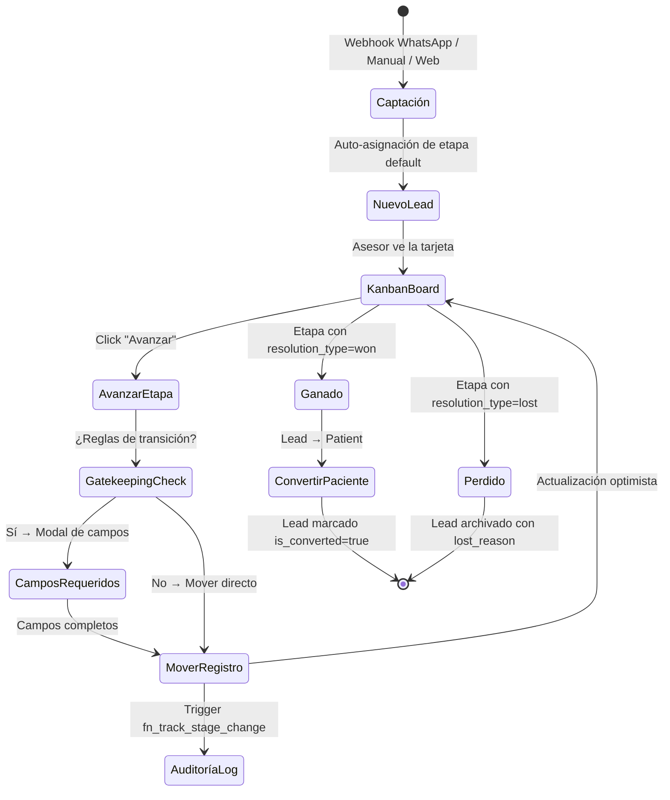

# Módulo: Pipeline de Leads (CRM Comercial)

> **Dominio**: `src/core/leads/`  
> **Feature Flag**: Ninguno (módulo core siempre activo)  
> **Roles con acceso**: `Super_Admin`, `Admin_Clinica`, `Asesor_Sucursal`

---

## 1. Propósito

El módulo de Leads es el motor comercial central del CRM. Gestiona el ciclo de vida completo de un prospecto desde su captación (manual, WhatsApp, web) hasta su conversión a paciente o descarte. Proporciona dos vistas: **Kanban Board** (tablero visual con drag & drop) y **Table View** (listado tabular con paginación, búsqueda, ordenamiento y acciones masivas).

---

## 2. Flujo de Trabajo Principal

---

## 3. Vistas del Módulo

### 3.1 Vista Kanban (`LeadsPipeline`)

**Archivo**: [LeadsPipeline.tsx](file:///d:/Clínica Rangel/src/core/leads/LeadsPipeline.tsx)

- Renderiza el componente reutilizable `UniversalPipelineBoard` con `boardType="leads"`.
- Filtra leads con `is_converted.is.null OR is_converted.eq.false` (excluyendo convertidos).
- Límite de carga: 2,000 registros por query.
- **Filtrado por rol** (líneas 43-47):
  - `Asesor_Sucursal`: solo sus leads asignados (`assigned_to = currentUser.id`).
  - `Admin_Clinica`: leads de su sucursal (`sucursal_id = branchId`).
  - `Super_Admin`: todos los leads del tenant (sin filtro adicional — RLS ya filtra por `clinica_id`).
- Barra de herramientas con: búsqueda, filtros por asesor/fuente/etiqueta, contador de resultados.

### 3.2 Vista Tabla (`LeadsTable`)

**Archivo**: [LeadsTable.tsx](file:///d:/Clínica Rangel/src/core/leads/LeadsTable.tsx)

- Tabla paginada (50 registros/página) con ordenamiento por columnas.
- **Acciones masivas**: Selección múltiple + asignación/desasignación en lote (líneas 181-201).
- **Columnas**: Nombre, Contacto (tel/email), Origen, Estado (stage badge), Asesor, Fecha.
- Acceso al drawer de configuración del embudo (`PipelineConfig boardType="leads"`).
- Límite de carga: 5,000 registros.

### 3.3 Detalle de Lead (`LeadDetail`)

**Archivo**: [LeadDetail.tsx](file:///d:/Clínica Rangel/src/core/leads/LeadDetail.tsx)

Layout de 3 columnas:

| Columna | Contenido |
|---------|-----------|
| **Izquierda** (280px) | Tarjeta de contacto, campos editables inline (email, teléfono, etapa, sub-etapa, servicio, fuente), botón "Convertir a Paciente" |
| **Centro** (flexible) | 6 tabs: Actividad, Notas (localStorage), WhatsApp (embebido), Tareas (`EntityTasks`), Correos (próximamente), Llamadas (próximamente) |
| **Derecha** (280px) | Servicio de interés, estado del pipeline con barra de progreso, asesor asignado, tags, deals, botones de resolución (Ganado/Perdido) |

**Mutaciones clave**:
- `updateField`: Actualización inline de cualquier campo → `leads.update()`.
- `resolveLeadMutation`: Cierre como ganado (con `sale_value` opcional) o perdido (con `lost_reason` obligatorio).
- `convertToPatientMutation`: Crea paciente con `converted_from_lead_id`, marca lead como `is_converted=true`.

### 3.4 Creación de Lead (`AddLeadModal`)

**Archivo**: [AddLeadModal.tsx](file:///d:/Clínica Rangel/src/core/leads/AddLeadModal.tsx)

- Campos: Nombre (requerido), Teléfono, Email, Fuente (select predefinido), Servicio (select dinámico), Asignar a.
- Auto-asigna `stage_id` default + `stage_entered_at`.
- Si el usuario es `Asesor_Sucursal`, se auto-asigna como `assigned_to`.
- Se asigna la primera sucursal disponible si el usuario no tiene una.

---

## 4. Componente Compartido: `UniversalPipelineBoard`

**Archivo**: [UniversalPipelineBoard.tsx](file:///d:/Clínica Rangel/src/components/pipeline/UniversalPipelineBoard.tsx)

Componente reutilizable para los 3 tableros Kanban (leads, citas, deals).

| Feature | Implementación |
|---------|---------------|
| **Virtualización** | `@tanstack/react-virtual` con `estimateSize: 160px` y `overscan: 5` |
| **SLA Timer** | Indicador rojo si `stage_entered_at` excede `sla_hours` de la sub-etapa |
| **Priorizar Estancados** | Toggle que ordena registros con SLA vencido al inicio |
| **Gatekeeping** | Modal de campos obligatorios según `stage_transition_rules` |
| **Avance automático** | Lógica de siguiente etapa/sub-etapa con `handleMove()` (líneas 116-163) |
| **Asignación inline** | Select de asesor en cada tarjeta |
| **Conversión** | Botón "Convertir a Paciente" en columnas con `resolution_type=won` (solo para leads) |

---

## 5. Archivos Clave

| Archivo | Propósito | Líneas |
|---------|-----------|--------|
| [LeadsPipeline.tsx](file:///d:/Clínica Rangel/src/core/leads/LeadsPipeline.tsx) | Vista Kanban del pipeline de leads | 153 |
| [LeadsTable.tsx](file:///d:/Clínica Rangel/src/core/leads/LeadsTable.tsx) | Vista tabular con acciones masivas | 503 |
| [LeadDetail.tsx](file:///d:/Clínica Rangel/src/core/leads/LeadDetail.tsx) | Detalle full-page de un lead (3 columnas) | 1,039 |
| [AddLeadModal.tsx](file:///d:/Clínica Rangel/src/core/leads/AddLeadModal.tsx) | Modal de creación de nuevo lead | 215 |
| [UniversalPipelineBoard.tsx](file:///d:/Clínica Rangel/src/components/pipeline/UniversalPipelineBoard.tsx) | Tablero Kanban reutilizable (leads/citas/deals) | 473 |
| [EntityTasks.tsx](file:///d:/Clínica Rangel/src/components/tasks/EntityTasks.tsx) | Widget de tareas vinculadas a entidad | — |
| [useClinicTags.ts](file:///d:/Clínica Rangel/src/hooks/useClinicTags.ts) | Hooks para tags y etiquetas | — |

---

## 6. Queries React Query

| Query Key | Tabla | Filtros | Uso |
|-----------|-------|---------|-----|
| `['leads', branchId, role]` | `leads` | `is_converted=false`, limit 2000 | Kanban Board |
| `['leads-admin-table', clinicaId]` | `leads` | `is_converted=false`, limit 5000 | Table View |
| `['lead', leadId]` | `leads` | `.eq('id', leadId).single()` | Lead Detail |
| `['pipeline_stages_leads', clinicaId]` | `pipeline_stages` | `board_type=leads`, `is_archived=false` | Columnas Kanban |
| `['pipeline_substages', clinicaId]` | `pipeline_substages` | Join con `pipeline_stages.clinica_id` | Sub-etapas |
| `['lead_history', leadId]` | `pipeline_history_log` | `.eq('lead_id', leadId)` | Timeline de actividad |
| `['team_members', clinicaId]` | `profiles` | `.eq('clinica_id', clinicaId)` | Dropdown de asesores |
| `['services_list', clinicaId]` | `services` | `.eq('clinica_id', clinicaId)` | Dropdown de servicios |
