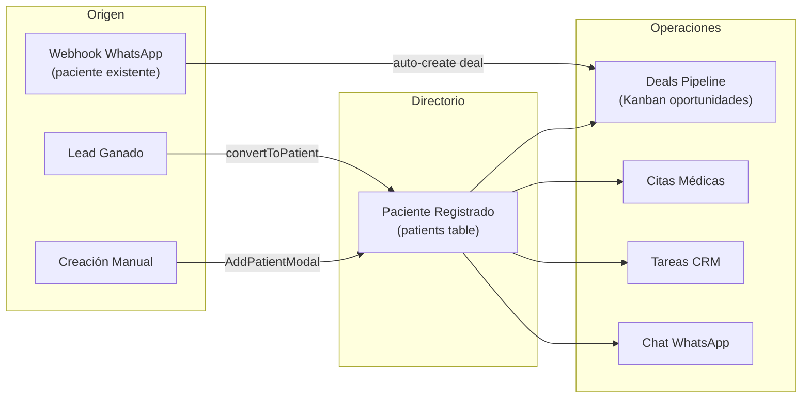

# Módulo: Gestión de Pacientes

> **Dominio**: `src/modules/clinic/patients/`  
> **Feature Flag**: `clinic_core` (requiere activación en `active_modules`)  
> **Roles con acceso**: `Super_Admin`, `Admin_Clinica`, `Asesor_Sucursal`

---

## 1. Propósito

El módulo de Pacientes gestiona el directorio de pacientes fidelizados y sus oportunidades comerciales (deals/tickets). Un paciente es un lead que fue promovido exitosamente a través del embudo comercial, o creado manualmente. Este módulo proporciona tres vistas según el rol del usuario y dos modos de visualización: **Tablero de Oportunidades** (Kanban de deals) y **Directorio Listado** (tabla con búsqueda y exportación CSV).

---

## 2. Flujo de Trabajo Principal



---

## 3. Vistas del Módulo por Rol

**Archivo de routing**: [App.tsx:248](file:///d:/Clínica Rangel/src/App.tsx#L248)

| Rol | Vista | Componente | Ruta |
|-----|-------|-----------|------|
| `Super_Admin` | Tabla administrativa | `PatientsTable` | `/pacientes` |
| `Admin_Clinica` | Kanban + Directorio | `Patients` | `/pacientes` |
| `Asesor_Sucursal` | Directorio simplificado | `PatientsDirectory` | `/pacientes` |
| Todos | Detalle de paciente | `PatientDetail` | `/pacientes/:id` |

---

## 4. Componentes Principales

### 4.1 Vista Dual (`Patients`)

**Archivo**: [Patients.tsx](file:///d:/Clínica Rangel/src/modules/clinic/patients/Patients.tsx)

Toggle entre dos modos:
- **Tablero de Oportunidades** → Renderiza `DealsPipeline` (Kanban con `UniversalPipelineBoard boardType="deals"`).
- **Directorio Listado** → Tabla con búsqueda por nombre, estado y etiquetas.

**Export CSV** (líneas 37-57): Genera CSV con BOM UTF-8 para compatibilidad con Excel, incluyendo nombre, teléfono, email, edad, estado, etiquetas y fecha de registro.

### 4.2 Pipeline de Oportunidades (`DealsPipeline`)

**Archivo**: [DealsPipeline.tsx](file:///d:/Clínica Rangel/src/modules/clinic/patients/DealsPipeline.tsx)

- Usa `UniversalPipelineBoard` con `boardType="deals"`, `tableName="deals"`.
- Los deals se consultan de la tabla `deals` filtrando por `sucursal_id`.
- Cada tarjeta muestra: nombre del paciente, valor estimado, etapa del pipeline.

### 4.3 Detalle de Paciente (`PatientDetail`)

**Archivo**: [PatientDetail.tsx](file:///d:/Clínica Rangel/src/modules/clinic/patients/PatientDetail.tsx)

Layout de 3 columnas similar a `LeadDetail`:

| Columna | Contenido |
|---------|-----------|
| **Izquierda** | Tarjeta de contacto, datos demográficos editables, botón WhatsApp |
| **Centro** | Tabs: Actividad, Notas, WhatsApp embebido, Tareas, Deals |
| **Derecha** | Tags, estadísticas, servicios recibidos, historial de deals |

### 4.4 Creación de Paciente (`AddPatientModal`)

**Archivo**: [AddPatientModal.tsx](file:///d:/Clínica Rangel/src/modules/clinic/patients/AddPatientModal.tsx)

Campos: Nombre (requerido), Teléfono, Email, Edad, Estado (select), Asignar a.

### 4.5 Tabla Administrativa (`PatientsTable`)

**Archivo**: [PatientsTable.tsx](file:///d:/Clínica Rangel/src/modules/clinic/patients/PatientsTable.tsx)

Vista solo para `Super_Admin` con tabla paginada, ordenamiento, filtros avanzados y columnas adicionales (asesor, sucursal).

---

## 5. Conversión Lead → Paciente

La conversión se implementa en dos lugares con lógica idéntica:

1. **LeadDetail.tsx** → botón "Convertir a Paciente" (líneas 188-214).
2. **UniversalPipelineBoard.tsx** → botón "Convertir a Paciente" en columna `resolution_type=won` (líneas 78-103).

```typescript
// Lógica de conversión (LeadDetail.tsx:188-213)
const convertToPatientMutation = useMutation({
    mutationFn: async () => {
        // 1. Crear paciente vinculado al lead original
        await supabase.from('patients').insert([{
            name: lead.name,
            status: 'Activo',
            assigned_to: lead.assigned_to,
            sucursal_id: lead.sucursal_id,
            email: lead.email,
            phone: lead.phone,
            converted_from_lead_id: leadId,  // ← trazabilidad
        }])
        // 2. Marcar lead como convertido (NO se elimina — preserva historial)
        await supabase.from('leads').update({
            is_converted: true,
            converted_at: new Date().toISOString(),
        }).eq('id', leadId)
    },
})
```

> **Decisión de diseño**: Los leads se marcan como `is_converted=true` en vez de eliminarse, preservando el historial de pipeline y la trazabilidad para reportes comerciales.

---

## 6. Archivos Clave

| Archivo | Propósito | Tamaño |
|---------|-----------|--------|
| [Patients.tsx](file:///d:/Clínica Rangel/src/modules/clinic/patients/Patients.tsx) | Vista dual (Kanban + Directorio) | 10 KB |
| [PatientsTable.tsx](file:///d:/Clínica Rangel/src/modules/clinic/patients/PatientsTable.tsx) | Tabla administrativa paginada | 15 KB |
| [PatientsDirectory.tsx](file:///d:/Clínica Rangel/src/modules/clinic/patients/PatientsDirectory.tsx) | Directorio simplificado (Asesor) | 11 KB |
| [PatientDetail.tsx](file:///d:/Clínica Rangel/src/modules/clinic/patients/PatientDetail.tsx) | Detalle full-page (3 columnas) | 41 KB |
| [DealsPipeline.tsx](file:///d:/Clínica Rangel/src/modules/clinic/patients/DealsPipeline.tsx) | Kanban de oportunidades (deals) | 6 KB |
| [AddPatientModal.tsx](file:///d:/Clínica Rangel/src/modules/clinic/patients/AddPatientModal.tsx) | Modal de creación | 10 KB |
