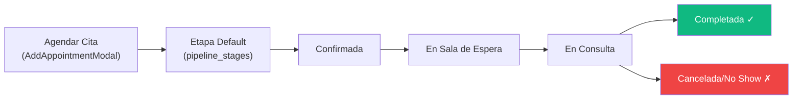

# Módulo: Citas Médicas (Appointments)

> **Dominio**: `src/modules/clinic/appointments/`  
> **Feature Flag**: `clinic_core`  
> **Roles con acceso**: `Super_Admin`, `Admin_Clinica`, `Asesor_Sucursal`

---

## 1. Propósito

El módulo de Citas gestiona el agendamiento, seguimiento y cierre de citas médicas. Utiliza el mismo motor de pipeline universal (`UniversalPipelineBoard`) que leads y deals, proporcionando un tablero Kanban con etapas configurables y una vista tabular administrativa. Cada cita vincula un paciente con un servicio, un doctor y una fecha/hora.

---

## 2. Flujo de Trabajo Principal

> Las etapas son configurables por clínica a través de `pipeline_stages` con `board_type='appointments'`.

---

## 3. Vistas del Módulo por Rol

**Routing**: [App.tsx:247](file:///d:/Clínica Rangel/src/App.tsx#L247)

| Rol | Vista | Componente |
|-----|-------|-----------|
| `Super_Admin` | Tabla administrativa | `AppointmentsTable` |
| `Admin_Clinica` / `Asesor_Sucursal` | Kanban Board | `AppointmentsPipeline` |

---

## 4. Componentes Principales

### 4.1 Pipeline de Citas (`AppointmentsPipeline`)

**Archivo**: [AppointmentsPipeline.tsx](file:///d:/Clínica Rangel/src/modules/clinic/appointments/AppointmentsPipeline.tsx)

- Filtra citas por `sucursal_id` del usuario actual (línea 24).
- Límite: 2,000 citas por query.
- **Barra de herramientas**: Búsqueda por nombre/teléfono/servicio/doctor, filtro por asesor, contador.
- Cada tarjeta en el Kanban muestra: `{patient_name} - {service_name}`, fecha, hora.
- Renderiza `UniversalPipelineBoard` con `boardType="appointments"`, `tableName="appointments"`.

### 4.2 Tabla Administrativa (`AppointmentsTable`)

**Archivo**: [AppointmentsTable.tsx](file:///d:/Clínica Rangel/src/modules/clinic/appointments/AppointmentsTable.tsx)

- Vista tabular con paginación, ordenamiento y acciones por fila.
- Solo accesible para `Super_Admin`.
- Columnas: Paciente, Servicio, Doctor, Fecha, Hora, Estado, Asesor, Sucursal.

### 4.3 Modal de Agendamiento (`AddAppointmentModal`)

**Archivo**: [AddAppointmentModal.tsx](file:///d:/Clínica Rangel/src/modules/clinic/appointments/AddAppointmentModal.tsx)

Campos al agendar:

| Campo | Tipo | Requerido |
|-------|------|-----------|
| `patient_name` | text | ✓ |
| `phone` | tel | ✗ |
| `email` | email | ✗ |
| `service` / `service_name` | select (servicios) | ✓ |
| `doctor_name` | select (doctores) | ✗ |
| `appointment_date` | date | ✓ |
| `appointment_time` | time | ✓ |

Auto-asigna: `stage_id` (etapa default del pipeline), `sucursal_id`, `assigned_to`.

---

## 5. Diferenciación con Calendario/Tareas

| Feature | Citas (`appointments`) | Tareas (`CalendarTasks`) |
|---------|----------------------|------------------------|
| Motor visual | `UniversalPipelineBoard` | Calendario mensual + lista |
| Tabla DB | `appointments` | `crm_tasks` |
| Vinculación | Paciente + Servicio + Doctor | Lead/Paciente + Asesor |
| Pipeline | Sí (etapas configurables) | No (estados fijos) |
| Feature Flag | `clinic_core` | Siempre activo |

---

## 6. Archivos Clave

| Archivo | Propósito | Tamaño |
|---------|-----------|--------|
| [AppointmentsPipeline.tsx](file:///d:/Clínica Rangel/src/modules/clinic/appointments/AppointmentsPipeline.tsx) | Kanban Board de citas | 6 KB |
| [AppointmentsTable.tsx](file:///d:/Clínica Rangel/src/modules/clinic/appointments/AppointmentsTable.tsx) | Tabla administrativa | 18 KB |
| [AddAppointmentModal.tsx](file:///d:/Clínica Rangel/src/modules/clinic/appointments/AddAppointmentModal.tsx) | Modal de agendamiento | 12 KB |

---

## 7. Queries React Query

| Query Key | Tabla | Filtros |
|-----------|-------|---------|
| `['appointments', branchId]` | `appointments` | `.eq('sucursal_id', branchId)`, limit 2000 |
| `['pipeline_stages', clinicaId, 'appointments']` | `pipeline_stages` | `board_type='appointments'`, `is_archived=false` |
| `['team_members', clinicaId]` | `profiles` | `.eq('clinica_id', clinicaId)` |
