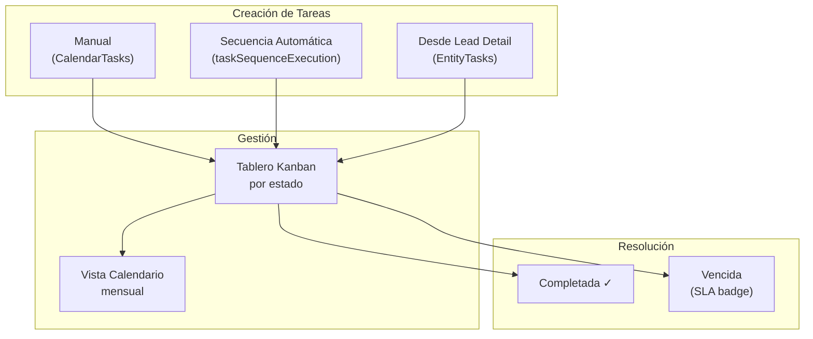
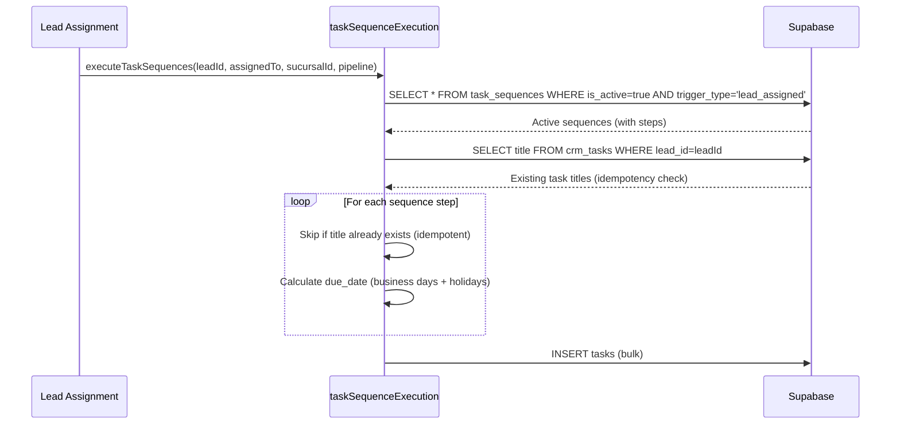

# Módulo: Calendario y Tareas CRM

> **Dominio**: `src/core/calendar/`  
> **Feature Flag**: Ninguno (módulo core siempre activo)  
> **Roles con acceso**: `Super_Admin`, `Admin_Clinica`, `Asesor_Sucursal`  
> **Ruta**: `/tareas`

---

## 1. Propósito

El módulo de Calendario y Tareas centraliza la gestión de tareas operativas del CRM, presentándolas en un **tablero Kanban por columnas de estado** con opciones de vista de calendario mensual y listado. Las tareas pueden vincularse a leads o pacientes, generarse manualmente o crearse automáticamente a través del motor de **Secuencias de Tareas** (automatizaciones).

---

## 2. Flujo de Trabajo Principal



---

## 3. Componente Principal (`CalendarTasks`)

**Archivo**: [CalendarTasks.tsx](file:///d:/Clínica Rangel/src/core/calendar/CalendarTasks.tsx) — 24 KB

### 3.1 Vistas disponibles

- **Kanban**: Columnas `pendiente`, `en_progreso`, `completada` con tarjetas por tarea.
- **Calendario**: Grilla mensual con indicadores por día.

### 3.2 Filtros

- Por tipo de tarea (`llamada`, `email`, `reunión`, `seguimiento`, `otro`).
- Por prioridad (`baja`, `normal`, `alta`, `urgente`).
- Por asesor asignado.
- Rango de fechas.
- **Exclusión automática**: Tareas de leads cerrados/perdidos/archivados se filtran del Kanban global.

### 3.3 Creación de tareas

Los campos de creación incluyen:

| Campo | Tipo | Requerido |
|-------|------|-----------|
| `title` | text | ✓ |
| `description` | textarea | ✗ |
| `task_type` | select | ✓ |
| `priority` | select | ✓ |
| `due_date` | datetime | ✓ |
| `lead_id` | select (leads) | ✗ |
| `assigned_to` | select (equipo) | ✓ |

---

## 4. Motor de Secuencias de Tareas

**Archivo**: [taskSequenceExecution.ts](file:///d:/Clínica Rangel/src/services/taskSequenceExecution.ts) — 146 líneas

Este motor ejecuta la creación automática de tareas cuando un lead es asignado, basado en secuencias pre-configuradas por el administrador.

### 4.1 Flujo de ejecución



### 4.2 Cálculo de días hábiles

```typescript
// addBusinessDays() — Excluye fines de semana + días festivos configurados
function addBusinessDays(baseDate: Date, nDays: number, holidays: Set<string>): Date {
    // Avanza día a día, saltando sábados, domingos y días festivos
    // Holidays cargados desde task_sequences.holidays[]
}
```

**Días festivos de México 2026** pre-cargados (líneas 137-145):
- Año Nuevo, Constitución, Benito Juárez, Día del Trabajo, Independencia, Revolución, Navidad.

### 4.3 Idempotencia

El motor verifica títulos existentes antes de insertar:
1. Consulta `crm_tasks WHERE lead_id = ?` para obtener títulos existentes.
2. Usa un `Set<string>` para filtrar duplicados intra-batch.
3. Solo inserta tareas con títulos nuevos.

---

## 5. Configuración de Secuencias (`TaskSequenceConfig`)

**Archivo**: [TaskSequenceConfig.tsx](file:///d:/Clínica Rangel/src/core/organizations/TaskSequenceConfig.tsx) — 21 KB

**Ruta**: `/automatizaciones` (requiere feature flag `automations`)

Panel administrativo (`Super_Admin`) para:
- CRUD de secuencias de tareas.
- Configuración de pasos ordenados (título, tipo, prioridad, delay en días/horas).
- Selección de pipeline trigger (`leads`, `deals`, `all`).
- Editor de días festivos personalizados.

---

## 6. Archivos Clave

| Archivo | Propósito | Tamaño |
|---------|-----------|--------|
| [CalendarTasks.tsx](file:///d:/Clínica Rangel/src/core/calendar/CalendarTasks.tsx) | Kanban de tareas + calendario | 24 KB |
| [taskSequenceExecution.ts](file:///d:/Clínica Rangel/src/services/taskSequenceExecution.ts) | Motor de secuencias automáticas | 5 KB |
| [TaskSequenceConfig.tsx](file:///d:/Clínica Rangel/src/core/organizations/TaskSequenceConfig.tsx) | Admin de automatizaciones | 21 KB |
| [EntityTasks.tsx](file:///d:/Clínica Rangel/src/components/tasks/EntityTasks.tsx) | Widget de tareas embebido (lead/paciente) | — |

---

## 7. Queries React Query

| Query Key | Tabla | Filtros |
|-----------|-------|---------|
| `['crm_tasks', sucursalId]` | `crm_tasks` | `sucursal_id`, excluye leads cerrados |
| `['entity_tasks', entityId]` | `crm_tasks` | `lead_id` or `patient_id` |
| `['task_sequences', clinicaId]` | `task_sequences` | `is_active=true` |
