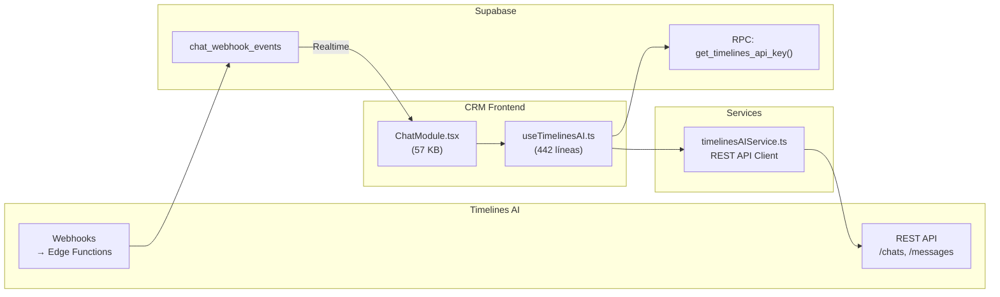

# Módulo: Chat WhatsApp (Timelines AI)

> **Dominio**: `src/core/chat/`  
> **Feature Flag**: `chat_whatsapp`  
> **Roles con acceso**: `Super_Admin`, `Admin_Clinica`, `Asesor_Sucursal`  
> **Ruta**: `/chat`

---

## 1. Propósito

El módulo de Chat proporciona una bandeja de entrada unificada de WhatsApp dentro del CRM, integrando **Timelines AI** como proveedor. Permite a los asesores gestionar conversaciones en tiempo real con notificaciones, envío de archivos/audio, etiquetas, notas internas y enlace directo con leads/pacientes por número de teléfono.

---

## 2. Arquitectura de Integración



---

## 3. Hooks y Data Flow

**Archivo**: [useTimelinesAI.ts](file:///d:/Clínica Rangel/src/core/chat/useTimelinesAI.ts) — 442 líneas

### 3.1 API Key Segura

```typescript
function useApiKey() {
    // Llama a supabase.rpc('get_timelines_api_key') 
    // La API key se almacena encriptada en la DB y solo se expone vía RPC
    // staleTime: 5 min
}
```

### 3.2 Hooks Principales

| Hook | Propósito | Polling | Stale Time |
|------|-----------|---------|------------|
| `useChats()` | Lista paginada de conversaciones | 60s background | 30s |
| `useChatMessages(chatId)` | Mensajes de un chat específico | 15s fallback | 10s |
| `useSendMessage()` | Enviar texto (con optimistic update) | — | — |
| `useUploadAndSendFile()` | Enviar archivos/audio | — | — |
| `useUpdateChat()` | Cerrar/reabrir + asignar responsable | — | — |
| `useWorkspaceMembers()` | Miembros del workspace | — | 5 min |
| `useTemplates()` | Plantillas de WhatsApp | — | 5 min |
| `useCreateNewConversation()` | Iniciar nueva conversación | — | — |
| `useChatLabels(chatId)` | CRUD de etiquetas por chat | — | 60s |
| `useAddChatNote()` | Notas internas por chat | — | — |
| `useMessageStatus(uid)` | Estado de entrega (delivered/read) | — | 30s |
| `useChatByPhone(phone)` | Buscar chat por teléfono | — | 60s |
| `useMarkChatAsRead()` | Marcar como leído (optimistic) | — | — |

### 3.3 Real-time Updates (`useChatRealtime`)

```typescript
// Suscripción a Supabase Realtime en chat_webhook_events
// Cuando llega un INSERT con filter chat_id=eq.{chatId}:
// 1. Invalida cache de mensajes → refresh instantáneo
// 2. Invalida cache de lista de chats → actualiza last_message
// 3. Si event_type='message:received:new' → reproduce sonido
```

**Sonido de notificación**: Generado con Web Audio API — dos tonos sinusoidales (880Hz → 1100Hz, A5 → C#6).

### 3.4 Optimistic Updates (Envío de Mensajes)

```typescript
// useSendMessage() implementa patrón completo:
// onMutate: Añade mensaje temporal al cache
// onError: Rollback al snapshot previo
// onSuccess: Invalida queries a 2s y 4s (confirmación)
// onSettled: Resume mutations pausadas + invalida
```

---

## 4. Notificaciones Globales

**Archivo**: [useGlobalChatNotifications.ts](file:///d:/Clínica Rangel/src/core/chat/useGlobalChatNotifications.ts) — 6 KB

Se monta en el layout raíz (`GlobalNotificationsMount` en App.tsx línea 51-54). Escucha eventos de Realtime en `chat_webhook_events` sin filtro de chat específico para mostrar toasts de nuevos mensajes entrantes en cualquier pantalla del CRM.

---

## 5. Componente Principal (`ChatModule`)

**Archivo**: [ChatModule.tsx](file:///d:/Clínica Rangel/src/core/chat/ChatModule.tsx) — 57 KB

Layout de 2 paneles:

| Panel | Contenido |
|-------|-----------|
| **Sidebar** (300px) | Lista de chats con filtros (abierto/cerrado, tipo), búsqueda, unread badges, last message preview |
| **Main** (flexible) | Conversación activa: mensajes con bubbles, input con emoji/attach/audio, info del contacto, etiquetas, notas internas |

---

## 6. Archivos Clave

| Archivo | Propósito | Tamaño |
|---------|-----------|--------|
| [ChatModule.tsx](file:///d:/Clínica Rangel/src/core/chat/ChatModule.tsx) | UI principal del chat | 57 KB |
| [useTimelinesAI.ts](file:///d:/Clínica Rangel/src/core/chat/useTimelinesAI.ts) | Hooks React Query para Timelines AI | 16 KB |
| [useGlobalChatNotifications.ts](file:///d:/Clínica Rangel/src/core/chat/useGlobalChatNotifications.ts) | Listener global de notificaciones | 6 KB |
| [timelinesAIService.ts](file:///d:/Clínica Rangel/src/services/timelinesAIService.ts) | REST API client (CRUD) | — |

---

## 7. Seguridad

- **API Key**: Almacenada en DB, expuesta solo vía RPC `get_timelines_api_key()` con verificación de `clinica_id`.
- **Webhook Secret**: `TIMELINES_WEBHOOK_SECRET` en Supabase Edge Function secrets.
- **RLS**: `chat_webhook_events` filtrados por `clinica_id` del usuario autenticado.
