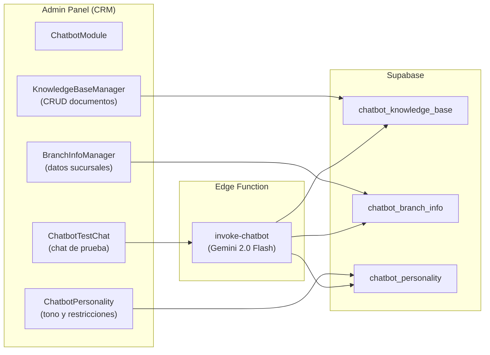

# Módulo: Chatbot AI (Clara)

> **Dominio**: `src/core/chatbot/`  
> **Feature Flag**: Ninguno (acceso limitado a `Super_Admin`)  
> **Roles con acceso**: `Super_Admin`  
> **Ruta**: `/chatbot`

---

## 1. Propósito

El módulo del Chatbot AI configura y prueba el asistente virtual **Clara** — un bot de atención al cliente basado en **Gemini 2.0 Flash** con RAG (Retrieval-Augmented Generation). Clara responde consultas de pacientes usando la base de conocimiento de la clínica, información de sucursales y una personalidad configurable.

---

## 2. Arquitectura del Chatbot

---

## 3. Tabs del Módulo

**Archivo**: [ChatbotModule.tsx](file:///d:/Clínica Rangel/src/core/chatbot/ChatbotModule.tsx) — 81 líneas

| Tab | Componente | Propósito |
|-----|-----------|-----------|
| **Chat de Prueba** | `ChatbotTestChat` | Interface de chat para probar respuestas del bot en vivo |
| **Base de Conocimiento** | `KnowledgeBaseManager` | CRUD de documentos (FAQ, políticas, servicios) para RAG |
| **Info Sucursales** | `BranchInfoManager` | Datos de ubicación, horarios, contacto por sucursal |
| **Personalidad** | `ChatbotPersonality` | Tono, nombre del bot, restricciones, prompt base |

---

## 4. Componentes Detallados

### 4.1 Base de Conocimiento (`KnowledgeBaseManager`)

**Archivo**: [KnowledgeBaseManager.tsx](file:///d:/Clínica Rangel/src/core/chatbot/KnowledgeBaseManager.tsx) — 11 KB

CRUD de documentos en `chatbot_knowledge_base`:
- **Campos**: `title`, `content`, `category`.
- Cada documento se inyecta como contexto en el prompt del Gemini para RAG.
- Categorías: FAQ, Servicios, Políticas, Promociones, etc.

### 4.2 Información de Sucursales (`BranchInfoManager`)

**Archivo**: [BranchInfoManager.tsx](file:///d:/Clínica Rangel/src/core/chatbot/BranchInfoManager.tsx) — 14 KB

Gestiona datos geolocalizados por sucursal:
- Dirección, teléfono, horarios de atención.
- Se usa para que Clara pueda dirigir pacientes a la sucursal más cercana.

### 4.3 Personalidad (`ChatbotPersonality`)

**Archivo**: [ChatbotPersonality.tsx](file:///d:/Clínica Rangel/src/core/chatbot/ChatbotPersonality.tsx) — 10 KB

Configura el comportamiento del bot:
- Nombre del asistente.
- Tono (formal, amigable, profesional).
- Restricciones (qué NO debe responder).
- Instrucciones personalizadas (prompt base).

### 4.4 Chat de Prueba (`ChatbotTestChat`)

**Archivo**: [ChatbotTestChat.tsx](file:///d:/Clínica Rangel/src/core/chatbot/ChatbotTestChat.tsx) — 9 KB

Chat en vivo contra la Edge Function `invoke-chatbot`:
- Muestra badge "🧪 Modo Test".
- Permite al administrador validar respuestas antes de exponer el bot a pacientes reales.
- Invoca la Edge Function con el `clinica_id` para inyectar el contexto correcto.

---

## 5. Tablas de Base de Datos

| Tabla | Propósito |
|-------|-----------|
| `chatbot_knowledge_base` | Documentos de conocimiento para RAG (filtrados por `clinica_id`) |
| `chatbot_branch_info` | Datos por sucursal para respuestas geolocalizadas |
| `chatbot_personality` | Configuración de tono, nombre y restricciones |

---

## 6. Archivos Clave

| Archivo | Propósito | Tamaño |
|---------|-----------|--------|
| [ChatbotModule.tsx](file:///d:/Clínica Rangel/src/core/chatbot/ChatbotModule.tsx) | Container con tabs | 3 KB |
| [ChatbotTestChat.tsx](file:///d:/Clínica Rangel/src/core/chatbot/ChatbotTestChat.tsx) | Chat de prueba en vivo | 9 KB |
| [KnowledgeBaseManager.tsx](file:///d:/Clínica Rangel/src/core/chatbot/KnowledgeBaseManager.tsx) | CRUD knowledge base | 11 KB |
| [BranchInfoManager.tsx](file:///d:/Clínica Rangel/src/core/chatbot/BranchInfoManager.tsx) | Datos de sucursales | 14 KB |
| [ChatbotPersonality.tsx](file:///d:/Clínica Rangel/src/core/chatbot/ChatbotPersonality.tsx) | Config personalidad | 10 KB |
