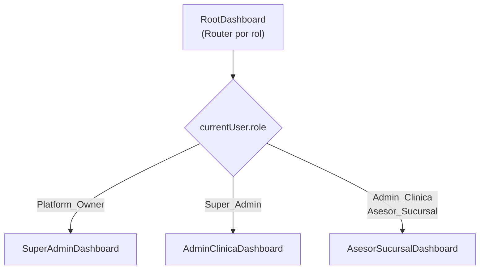

# Módulo: Dashboards y Reportes

> **Dominio**: `src/core/dashboards/` + `src/core/analytics/`  
> **Feature Flag**: `analytics` (para reportes avanzados)  
> **Roles con acceso**: Todos (vista diferenciada por rol)  
> **Rutas**: `/dashboard`, `/reportes`

---

## 1. Propósito

El módulo de Dashboards proporciona vistas ejecutivas diferenciadas por rol, con KPIs, gráficos y métricas operativas. El sub-módulo de Reportes ofrece analíticas avanzadas con filtros temporales y visualizaciones detalladas para toma de decisiones.

---

## 2. Arquitectura de Dashboards por Rol

**Archivo**: [RootDashboard.tsx](file:///d:/Clínica Rangel/src/core/dashboards/RootDashboard.tsx) — 36 líneas

### 2.1 SuperAdminDashboard

**Archivo**: [SuperAdminDashboard.tsx](file:///d:/Clínica Rangel/src/core/dashboards/SuperAdminDashboard.tsx)

Vista del Platform Owner con métricas de todas las clínicas:
- Total de clínicas activas.
- Leads globales.
- Revenue agregado.

### 2.2 AdminClinicaDashboard

**Archivo**: [AdminClinicaDashboard.tsx](file:///d:/Clínica Rangel/src/core/dashboards/AdminClinicaDashboard.tsx) — 3 KB

Vista del administrador de una clínica con:
- KPIs: leads totales, leads activos, tasa de conversión, valor pipeline.
- Gráfico de leads por etapa.
- Tabla de asesores con rendimiento.
- Tareas pendientes del equipo.

### 2.3 AsesorSucursalDashboard

**Archivo**: [AsesorSucursalDashboard.tsx](file:///d:/Clínica Rangel/src/core/dashboards/AsesorSucursalDashboard.tsx) — 2 KB

Vista del asesor de sucursal con:
- KPIs personales: mis leads, mis tareas pendientes, mis citas del día.
- Accesos directos: leads, tareas, chat.
- Skeleton loading para transiciones (líneas 8-21 en `RootDashboard`).

---

## 3. Reportes Avanzados (`ReportsDashboard`)

**Archivo**: [ReportsDashboard.tsx](file:///d:/Clínica Rangel/src/core/analytics/ReportsDashboard.tsx) — 24 KB  
**Feature Flag**: `analytics`  
**Ruta**: `/reportes`

Dashboard analítico con:
- Filtros temporales (hoy, semana, mes, trimestre, rango personalizado).
- Métricas por asesor, por sucursal, por servicio.
- Gráficos de embudo (conversión por etapa).
- Tablas comparativas de rendimiento.

---

## 4. Componentes de Dashboard

**Directorio**: [components/](file:///d:/Clínica Rangel/src/core/dashboards/components/)

Widgets reutilizables para construir dashboards:
- KPI cards con iconos y tendencias.
- Gráficos de barras/líneas.
- Tablas de ranking.
- Widgets de tareas pendientes.

---

## 5. Archivos Clave

| Archivo | Propósito | Tamaño |
|---------|-----------|--------|
| [RootDashboard.tsx](file:///d:/Clínica Rangel/src/core/dashboards/RootDashboard.tsx) | Router por rol | 2 KB |
| [SuperAdminDashboard.tsx](file:///d:/Clínica Rangel/src/core/dashboards/SuperAdminDashboard.tsx) | Dashboard Platform Owner | 1 KB |
| [AdminClinicaDashboard.tsx](file:///d:/Clínica Rangel/src/core/dashboards/AdminClinicaDashboard.tsx) | Dashboard Admin Clínica | 3 KB |
| [AsesorSucursalDashboard.tsx](file:///d:/Clínica Rangel/src/core/dashboards/AsesorSucursalDashboard.tsx) | Dashboard Asesor | 2 KB |
| [ReportsDashboard.tsx](file:///d:/Clínica Rangel/src/core/analytics/ReportsDashboard.tsx) | Reportes avanzados | 24 KB |
