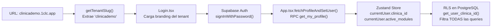
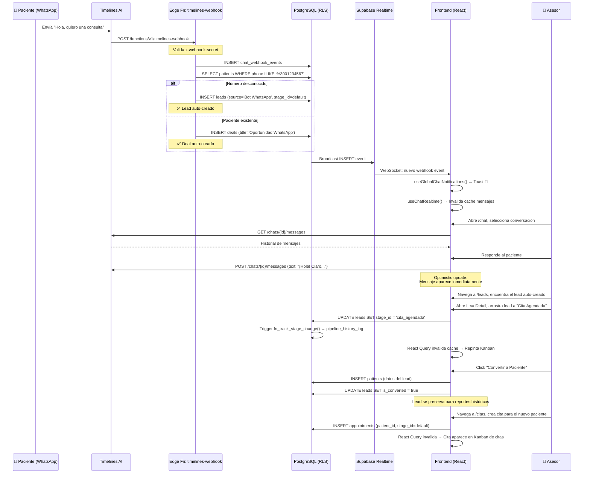

# 1Clinic CRM — Guía de Onboarding para Desarrolladores

> **Audiencia**: Desarrolladores que se incorporan al proyecto.  
> **Nivel**: De zero a contributor activo.  
> **Última actualización**: 2026-04-08

---

## 1. Qué es este Proyecto

**1Clinic CRM** es un SaaS multi-tenant que gestiona el ciclo de vida completo de un paciente/cliente:
captación de leads por WhatsApp → seguimiento vía pipeline Kanban → conversión a paciente → citas médicas → fidelización.

Cada clínica-cliente opera en su propio **subdominio** (`clinicademo.1clc.app`) con roles, branding y módulos independientes, sobre una sola instancia de código y base de datos protegida por **Row Level Security**.

---

## 2. Prerrequisitos

| Herramienta | Versión | Verificar con |
|-------------|---------|--------------|
| Node.js | 18+ | `node -v` |
| npm | 9+ | `npm -v` |
| Git | 2+ | `git --version` |
| Editor | VS Code recomendado | — |

**Extensiones de VS Code recomendadas**:
- Tailwind CSS IntelliSense
- ESLint
- TypeScript Importer
- Mermaid Preview (para leer la documentación)

---

## 3. Configuración del Entorno

### Paso 1: Clonar e instalar

```bash
git clone <repo-url> crm-clinicas
cd crm-clinicas
npm install
```

**Resultado esperado**: `added 243 packages in 12s`

### Paso 2: Configurar variables de entorno

```bash
cp .env.example .env.local
```

Editar `.env.local`:
```env
VITE_SUPABASE_URL=https://fkhtfybcyjldjsnhpsci.supabase.co
VITE_SUPABASE_ANON_KEY=<pedir al tech lead>
```

> ⚠️ La `anon key` es segura para el frontend — RLS protege toda la data. Pero NO la subas a GitHub.

### Paso 3: Levantar el servidor

```bash
npm run dev
```

**Resultado esperado**:
```
  VITE v5.1.4  ready in 400ms
  ➜  Local:   http://localhost:5173/
```

### Paso 4: Acceder

1. Navegar a `http://localhost:5173/login`
2. Usar las credenciales de prueba (pedir al tech lead).
3. Verificar que carga el dashboard según el rol.

---

## 4. Estructura del Código (Mapa Mental)

```
src/
├── App.tsx              ← EMPIEZA AQUÍ. Lee esto primero.
│                          Bootstrap de auth + tabla de rutas completa.
│
├── core/                ← Motor genérico (sirve para cualquier industria)
│   ├── auth/            ← Login, ModuleGuard, Onboarding, Invitaciones
│   ├── dashboards/      ← Dashboard por rol (3 variantes)
│   ├── leads/           ← Pipeline Kanban + LeadDetail
│   ├── calendar/        ← Tareas (CalendarTasks)
│   ├── chat/            ← WhatsApp (ChatModule + hooks)
│   ├── chatbot/         ← Chatbot IA (Clara)
│   ├── analytics/       ← Reportes avanzados
│   ├── organizations/   ← Sucursales, equipo, pipeline config
│   ├── settings/        ← Hub de configuración
│   └── catalogs/        ← Servicios, equipo, doctores
│
├── modules/             ← Plugins acoplables (requieren feature flag)
│   └── clinic/          ← clinic_core: pacientes, citas, doctores
│
├── components/          ← Reutilizables + "los 2 componentes que debes conocer"
│   ├── pipeline/UniversalPipelineBoard.tsx  ← EL componente más importante
│   └── tasks/EntityTasks.tsx                ← Tareas vinculadas a entidades
│
├── services/            ← Clientes de API
│   ├── supabase.ts                  ← Singleton del Supabase client
│   ├── timelinesAIService.ts        ← API completa de Timelines AI
│   ├── chatbotService.ts            ← CRUD chatbot + Edge Function
│   └── taskSequenceExecution.ts     ← Motor de tareas automáticas
│
├── store/useStore.ts    ← Zustand: solo currentUser (rol, tenant_id, modules)
├── hooks/               ← Custom hooks (useClinicTags, etc.)
└── utils/               ← getTenantSlug(), applyBrandColor()
```

### Los 3 archivos que DEBES leer primero

1. **`App.tsx`** (282 líneas) — Auth bootstrap + tabla de rutas completa. Aquí entiendes quién ve qué.
2. **`store/useStore.ts`** (210 líneas) — Todas las interfaces TypeScript del dominio (`Lead`, `Patient`, `Deal`, `CrmTask`, etc.).
3. **`components/pipeline/UniversalPipelineBoard.tsx`** (473 líneas) — El componente Kanban que alimenta leads, citas Y deals.

---

## 5. Conceptos Clave (Dominio)

### 5.1 Multi-Tenancy

Cada clínica-cliente es un **tenant**. Aislamiento garantizado por:



**Regla de oro**: Nunca hagas un `SELECT` sin `clinica_id`. RLS lo hará por ti, pero si estás en un Edge Function con Service Role Key, DEBES filtrarlo manualmente.

### 5.2 Pipeline Stages

El sistema no hardcodea las "etapas" de un embudo. Los administradores las configuran desde el UI y se guardan en `pipeline_stages`:

```
pipeline_stages
├── id, name, color, sort_order
├── board_type: 'leads' | 'deals' | 'appointments'
├── resolution_type: 'open' | 'won' | 'lost'
├── sla_hours (opcional)
└── clinica_id (RLS)
```

El `UniversalPipelineBoard` lee estas etapas dinámicamente y construye las columnas del Kanban en tiempo real.

### 5.3 Feature Flags

```typescript
// En App.tsx:
<Route element={<ModuleGuard requiredModule="clinic_core" />}>
    <Route path="/citas" element={...} />
    <Route path="/pacientes" element={...} />
</Route>
```

`ModuleGuard` lee `currentUser.active_modules` (un array de strings) y bloquea el renderizado si el módulo no está activo. Si necesitas agregar un nuevo módulo:

1. Agrega el string al array `active_modules` en la tabla `clinicas`.
2. Envuelve la ruta en `<ModuleGuard requiredModule="tu_modulo" />`.

### 5.4 Roles RBAC

```typescript
// store/useStore.ts:16
role: 'Platform_Owner' | 'Super_Admin' | 'Admin_Clinica' | 'Asesor_Sucursal'
```

| Rol | Quién es | Qué ve |
|-----|---------|--------|
| `Platform_Owner` | Dueño del SaaS | Todas las clínicas, dashboard global |
| `Super_Admin` | Dueño de la clínica | Tablas admin, config completa, chatbot |
| `Admin_Clinica` | Gerente regional | Kanban + dashboard analítico |
| `Asesor_Sucursal` | Empleado operativo | Solo datos de su sucursal |

---

## 6. Ciclo de Vida de una Petición: Ejemplo Completo

### 📖 Escenario: "Un paciente envía un WhatsApp y termina con una cita agendada"

Este ejemplo traza el flujo completo desde que un mensaje llega por WhatsApp hasta que un asesor agenda una cita.



### Desglose Archivo por Archivo

| Paso | Archivo | Línea(s) clave | Qué hace |
|------|---------|---------------|----------|
| 1. Webhook recibido | `supabase/functions/timelines-webhook/index.ts:31-130` | Parsea payload, valida secret, inserta evento |
| 2. Auto-crear lead | `supabase/functions/timelines-webhook/index.ts:134-259` | Normaliza teléfono, busca patient/lead, inserta si no existe |
| 3. Notificación global | `src/core/chat/useGlobalChatNotifications.ts` | Escucha Realtime en `chat_webhook_events` sin filtro |
| 4. Notificación en chat | `src/core/chat/useTimelinesAI.ts:useChatRealtime()` | Escucha Realtime filtrado por `chat_id`, invalida queries |
| 5. Listar mensajes | `src/services/timelinesAIService.ts:238-253` | `GET /chats/{id}/messages` → normaliza response |
| 6. Enviar respuesta | `src/services/timelinesAIService.ts:256-271` | `POST /chats/{id}/messages` + optimistic update |
| 7. Mover lead en Kanban | `src/components/pipeline/UniversalPipelineBoard.tsx:handleMove()` | Optimistic UI + `UPDATE leads SET stage_id` |
| 8. Conversión lead→paciente | `src/core/leads/LeadDetail.tsx` | `INSERT patients` + `UPDATE leads SET is_converted=true` |
| 9. Crear cita | `src/modules/clinic/appointments/AppointmentsPipeline.tsx` | `INSERT appointments` + React Query invalidation |

---

## 7. Tu Primera Tarea: Agregar un Campo a un Lead

Supongamos que necesitas agregar un campo `instagram` al formulario de leads.

### Paso 1: Base de datos
1. En el Supabase Dashboard, añadir columna `instagram TEXT NULL` a la tabla `leads`.
2. Verificar que las políticas RLS existentes lo cubren (sí, porque no filtran por columna).

### Paso 2: TypeScript
```typescript
// src/store/useStore.ts — Agregar al interface Lead
export interface Lead {
    // ... campos existentes ...
    instagram?: string;  // 👈 Nuevo
}
```

### Paso 3: Formulario (AddLeadModal)
```typescript
// Buscar el archivo del modal de agregar lead
// Agregar un input para instagram:
<input
    type="text"
    placeholder="@usuario_instagram"
    value={formData.instagram}
    onChange={(e) => setFormData({ ...formData, instagram: e.target.value })}
/>
```

### Paso 4: Persistencia
```typescript
// En la función de submit del formulario:
const { error } = await supabase.from('leads').insert({
    name: formData.name,
    phone: formData.phone,
    instagram: formData.instagram,  // 👈 Incluir
    // ... demás campos
})
```

### Paso 5: Verificar
```bash
npm run dev   # Abrir el modal, crear lead con Instagram, verificar en DB
npm run lint  # Asegurar 0 warnings
```

---

## 8. Patrones de Código ("Si quieres hacer X, sigue este patrón")

### 8.1 Agregar una query de datos (lectura)

```typescript
import { useQuery } from '@tanstack/react-query'
import { supabase } from '../services/supabase'
import { useStore } from '../store/useStore'

function useMisDatos() {
    const { currentUser } = useStore()
    
    return useQuery({
        queryKey: ['mi-entidad', currentUser?.clinica_id],
        queryFn: async () => {
            const { data, error } = await supabase
                .from('mi_tabla')
                .select('*')
                .eq('clinica_id', currentUser!.clinica_id)  // RLS ya filtra, pero sé explícito
                .order('created_at', { ascending: false })
            if (error) throw error
            return data
        },
        enabled: !!currentUser?.clinica_id,
    })
}
```

### 8.2 Agregar una mutación (escritura)

```typescript
import { useMutation, useQueryClient } from '@tanstack/react-query'

function useCrearEntidad() {
    const queryClient = useQueryClient()
    
    return useMutation({
        mutationFn: async (payload: MiPayload) => {
            const { data, error } = await supabase
                .from('mi_tabla')
                .insert(payload)
                .select()
                .single()
            if (error) throw error
            return data
        },
        onSuccess: () => {
            // Invalidar el cache para que la lista se actualice
            queryClient.invalidateQueries({ queryKey: ['mi-entidad'] })
        },
    })
}
```

### 8.3 Agregar una nueva ruta protegida

```typescript
// En App.tsx, dentro del bloque de rutas autenticadas:

// Ruta sin feature flag (todos los roles):
<Route path="/mi-nueva-ruta" element={<MiComponent />} />

// Ruta con feature flag:
<Route element={<ModuleGuard requiredModule="mi_modulo" />}>
    <Route path="/mi-ruta-premium" element={<MiComponent />} />
</Route>

// Ruta solo para un rol específico:
{currentUser.role === 'Super_Admin' && (
    <Route path="/mi-ruta-admin" element={<MiComponent />} />
)}
```

### 8.4 Usar el UniversalPipelineBoard para un nuevo tipo de pipeline

```typescript
import { UniversalPipelineBoard } from '../../components/pipeline/UniversalPipelineBoard'

function MiPipeline() {
    const { currentUser } = useStore()
    
    return (
        <UniversalPipelineBoard
            boardType="mi_tipo"             // Debe existir en pipeline_stages
            tableName="mi_tabla"            // Tabla de Supabase
            sucursalId={currentUser?.sucursal_id}
            clinicaId={currentUser?.clinica_id || ''}
            entityName="Mi Entidad"         // Label para UI
            renderCard={(item) => <MiCard item={item} />}
        />
    )
}
```

---

## 9. Errores Comunes y Cómo Resolverlos

| Error | Causa | Solución |
|-------|-------|----------|
| `"new row violates RLS policy"` | La tabla tiene RLS pero tu INSERT no incluye `clinica_id` o `sucursal_id` | Asegúrate de incluir `clinica_id` en cada INSERT. RLS valida contra `get_user_clinica_id()`. |
| Pantalla en blanco al navegar | Ruta no declarada en `App.tsx` o `ModuleGuard` bloqueando | Verificar que la ruta está registrada y que el tenant tiene el módulo activo. |
| React Query devuelve `undefined` | `enabled: false` porque `currentUser` aún no se ha hidratado | Usa `enabled: !!currentUser?.clinica_id` para esperar al auth bootstrap. |
| Chat no muestra mensajes nuevos | Canal Realtime no suscrito o `chat_id` incorrecto | Verificar que `useChatRealtime(chatId)` está montado con el `chatId` correcto. |
| `"Error al contactar al chatbot"` | Edge Function sin `GEMINI_API_KEY` configurada | Verificar secrets en Supabase Dashboard → Edge Functions → Secrets. |
| Kanban flicker al mover tarjeta | Optimistic update falló | Verificar que `queryClient.setQueryData()` en `onMutate` retorna el snapshot correcto. |
| `ModuleGuard` redirige | Tenant sin el módulo activo | Agregar el string del módulo al array `active_modules` en la tabla `clinicas`. |

---

## 10. Debugging

### 10.1 React Query DevTools

En desarrollo, React Query ya está configurado. Abre el panel con el ícono de flor en la esquina inferior izquierda. Ahí puedes ver:
- Todas las queries activas con sus keys.
- El estado del cache (fresh/stale/fetching).
- Re-ejecutar queries manualmente.

### 10.2 Supabase Logs

Para debugging de RLS o Edge Functions:
1. Ir a [Supabase Dashboard](https://supabase.com/dashboard) → Logs → Edge Functions.
2. Filtrar por `timelines-webhook` o `chatbot`.
3. Los `console.log` de las Edge Functions aparecen aquí.

### 10.3 Realtime Inspector

Para verificar que los canales WebSocket están activos:
1. Supabase Dashboard → Realtime → Inspector.
2. Verificar canales `chat_webhook_events`.

---

## 11. Glosario

| Término | Significado |
|---------|-------------|
| **Tenant** | Una clínica-cliente. Cada tenant tiene su propio subdominio, datos aislados y configuración. |
| **Slug** | Identificador URL del tenant (ej. `clinicademo` en `clinicademo.1clc.app`). |
| **RLS** | Row Level Security. Políticas de PostgreSQL que filtran datos automáticamente por `clinica_id`. |
| **Pipeline** | Flujo de etapas configurables (Kanban). Tipos: `leads`, `deals`, `appointments`. |
| **Stage** | Una etapa/columna del pipeline (ej. "Nuevo", "Contactado", "Cita Agendada"). |
| **Deal** | Una oportunidad de venta vinculada a un paciente existente. |
| **Lead** | Un prospecto/contacto que aún no es paciente. |
| **Feature Flag** | String en `active_modules[]` que habilita un módulo del CRM para un tenant específico. |
| **ModuleGuard** | Componente React que bloquea rutas si el tenant no tiene el módulo contratado. |
| **UniversalPipelineBoard** | El componente Kanban compartido por leads, citas y deals. |
| **Edge Function** | Función serverless en Deno que corre en Supabase. Usada para chatbot y webhooks. |
| **RAG** | Retrieval-Augmented Generation. El chatbot inyecta conocimiento de la DB en el prompt del LLM. |
| **Optimistic Update** | Patrón UI: se muestra el resultado esperado antes de que el servidor confirme. |
| **SLA** | Service Level Agreement. Tiempo máximo que un lead/paciente debería permanecer en una etapa. |
| **Board Type** | Discriminador que separa los pipelines: `leads`, `deals`, `appointments`. |
| **Hydration** | Proceso de cargar datos del servidor al estado del cliente después del login. |

---

## 12. Quick Reference Card

```
┌─────────────────────────────────────────────────────────────────┐
│  🚀 COMANDOS RÁPIDOS                                           │
├─────────────────────────────────────────────────────────────────┤
│  npm run dev          → Levantar servidor de desarrollo         │
│  npm run build        → Build de producción (tsc + vite)        │
│  npm run lint         → ESLint (0 warnings enforced)            │
│  npm run preview      → Preview del build                       │
├─────────────────────────────────────────────────────────────────┤
│  📂 ARCHIVOS CLAVE                                              │
├─────────────────────────────────────────────────────────────────┤
│  App.tsx              → Auth + routing (empieza aquí)            │
│  useStore.ts          → Interfaces TypeScript del dominio        │
│  UniversalPipelineBoard.tsx → Kanban compartido (THE component) │
│  timelinesAIService.ts      → API WhatsApp (586 líneas)         │
│  taskSequenceExecution.ts   → Motor de tareas automáticas       │
├─────────────────────────────────────────────────────────────────┤
│  🔑 PATRONES                                                    │
├─────────────────────────────────────────────────────────────────┤
│  Leer datos    → useQuery(['key', clinica_id], ...)             │
│  Escribir datos → useMutation(..., { onSuccess: invalidate })   │
│  Nueva ruta    → App.tsx + ModuleGuard si tiene feature flag    │
│  Nuevo pipeline → UniversalPipelineBoard + pipeline_stages      │
│  Estado UI     → Zustand (solo currentUser)                     │
│  Estado server → React Query (todo lo demás)                    │
├─────────────────────────────────────────────────────────────────┤
│  📖 DOCUMENTACIÓN                                               │
├─────────────────────────────────────────────────────────────────┤
│  docs/architecture/   → C4 + ADRs                               │
│  docs/database/       → Data dictionary (30+ tablas)             │
│  docs/modules/        → 8 módulos documentados                   │
│  docs/integrations/   → API endpoints map                        │
└─────────────────────────────────────────────────────────────────┘
```

---

## 13. ¿Dónde Obtener Ayuda?

| Recurso | Ubicación |
|---------|-----------|
| Documentación del proyecto | `docs/` en la raíz del repo |
| Supabase Dashboard | https://supabase.com/dashboard |
| Timelines AI Docs | https://timelinesai.mintlify.app/public-api-reference/overview |
| React Query Docs | https://tanstack.com/query/latest |
| Zustand Docs | https://zustand-demo.pmnd.rs/ |
| Tailwind CSS Docs | https://tailwindcss.com/docs |
